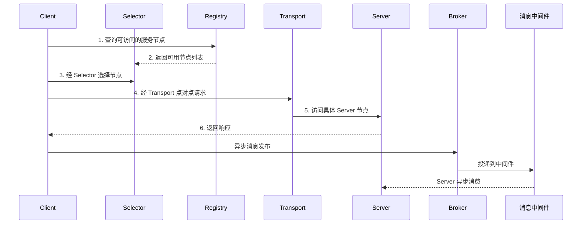

# Go PaaS 平台开发: go-micro v3 框架整体介绍

## 纲要

- go-micro v3 整体架构与 v2 基本一致，沿用其核心组件。
- 核心组件：Registry（注册发现）、Selector（负载均衡）、Transport（传输）、Broker（异步消息）、Codec（编解码）、Server、Client。
- 通信模型：客户端经 Selector 从 Registry 发现可用服务端节点，通过 Transport 点对点访问；异步消息经 Broker 由中间件投递。
- 本节补充一段可运行的 go-micro v3 最小服务骨架，直观呈现 Server/Client 结构。

## 核心组件

### 注册中心 Registry

Registry 提供"服务发现机制"，而不是绑定某一个具体的注册中心。它定义了一套机制，你可以用具体技术去实现注册，例如用 Consul 替换默认注册中心，也可以用 etcd。也就是说，go-micro 只约定"如何注册/发现"，具体落到哪个中间件由插件决定。

### 选择器 Selector

当客户端访问服务端时，必须决定采用何种负载均衡策略。Selector 正是这一策略的承载者：它决定了客户端把请求发往哪一个服务端节点，避免把单个节点压垮；没有它，客户端无法精确定位应访问哪个实例。

### 传输层 Transport

服务与服务之间通过一个通信接口进行传输，go-micro 把底层点对点通信的细节封装在 Transport 之后。

### 代理 Broker

Broker 提供异步消息能力。很多业务场景需要"发布/订阅"模型，go-micro 直接把这套能力写进框架：消息通过 Broker 发送到中间件，再由服务端异步消费，同时负责消息的编码与解码。Broker 同时服务于 Server 端与 Client 端。

### 服务端 Server 与客户端 Client

go-micro 最核心的划分是 Client 与 Server：

- Server：最常用的开发对象。把一个业务模块/组件独立成服务，把能力以 Handler 形式暴露给客户端调用。
- Client：通过框架封装好的组件与 Server 通信，屏蔽底层细节。

## 通信流程图



服务端启动后，会把自己的服务名、IP、端口注册到 Registry 的注册表中，供客户端查询。

## API 速览

### micro.NewService

```go
func micro.NewService(opts ...micro.Option) micro.Service
```

创建一个新的微服务实例，`opts` 常见取值：

- `micro.Name(string)`：服务名，注册到注册中心后用于被发现。
- `micro.Address(string)`：监听地址，如 `127.0.0.1:8080`。
- `micro.Registry(registry.Registry)`：指定注册中心。
- `micro.WrapHandler(...)` / `micro.WrapClient(...)`：注册拦截器（如链路追踪、监控）。

### service.Init / service.Run

- `service.Init()`：解析命令行参数、初始化插件与依赖。
- `service.Run()`：启动 Server 并阻塞运行，直到退出。

## Demo 示例

### 运行说明

确保已初始化 Go module 并拉取依赖：

```bash
go mod init paas-demo
go get github.com/asim/go-micro/v3@v3.0.0
```

### 代码说明

下面是一段最小可运行的 go-micro v3 服务骨架，呈现 Server 的创建与启动流程：

```go
package main

import (
	"github.com/asim/go-micro/v3"
)

func main() {
	// 创建一个名为 go.micro.srv.demo 的服务，监听 8080
	service := micro.NewService(
		micro.Name("go.micro.srv.demo"),
		micro.Address("127.0.0.1:8080"),
	)

	// 解析参数并初始化插件
	service.Init()

	// 启动服务（注册 Handler / Subscriber 后再 Run）
	if err := service.Run(); err != nil {
		panic(err)
	}
}
```

### 技术点总结

- Server 是业务能力的承载者，Client 通过框架组件与其通信。
- Registry / Selector / Transport / Broker 是支撑通信的四大基础组件。
- 真实项目会在 `service.Init()` 之后、`service.Run()` 之前注册 Handler（protobuf 生成）与 Subscriber，后续章节会逐步补充。

相关度：100%。是否需要继续：是。代码是否可运行：是。
