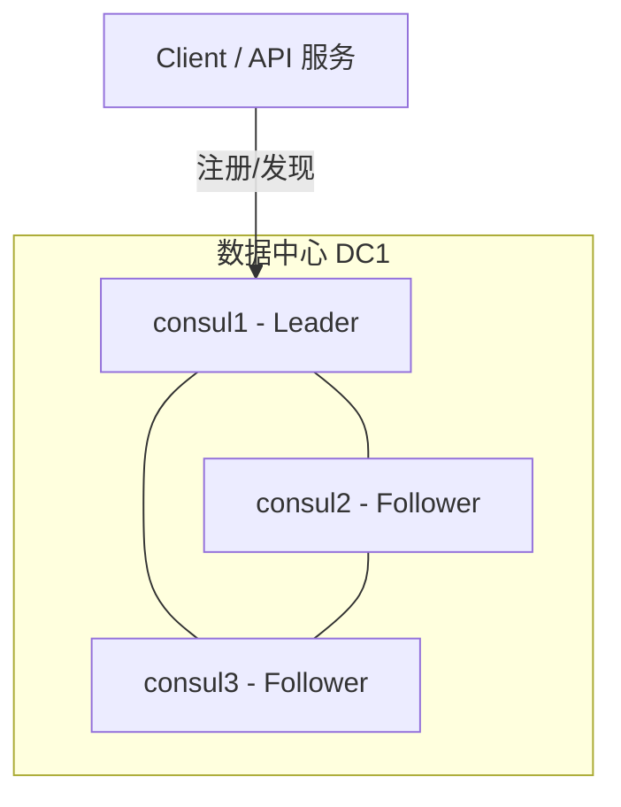

# Go PaaS 平台开发: go-micro v3 添加集群版 Consul（上）

## 纲要

- 注册中心与配置中心在 go-micro v3 中都可以基于 Consul 实现，本节先部署 Consul 集群版。
- 生产环境必须使用集群版而非单机版，以保证注册中心自身高可用。
- 用 docker-compose 启动一个 3 节点 Consul 集群（1 个 Leader + 2 个 Follower）并开启 UI。
- Consul 关键端口、多数据中心架构、健康检查机制是理解注册中心的核心。

## 为什么需要集群版注册中心

微服务部署出去后可能随时扩缩容或宕机。客户端要能"最大限度访问到存活的服务"，因此需要注册中心：

1. 服务 A 把"服务名 + IP + 端口"注册到注册中心。
2. 客户端 B 查询服务 A 对应的 IP/端口，直接发起调用。
3. 注册中心默认每隔固定间隔（约 10 秒）对服务做健康检查，异常节点会被剔除。

单机版注册中心一旦挂掉，整个服务发现链路失效，因此生产环境应使用集群版——多个 Consul Server 节点通过选举产生一个 Leader，数据在节点间一致复制。

## Consul 集群架构



Consul 集群节点分为 Server（参与选举、存储数据）与 Client（转发请求、不做决策）。上面的 3 个 Server 节点通过 Raft 选举出 Leader，Client 把请求转发给 Server。

## 关键端口

| 端口 | 作用 |
| --- | --- |
| 8500 | HTTP API 与 Web UI |
| 8501 | HTTPS API |
| 8502 | gRPC API |
| 8300 | Server 间 RPC |
| 8301 | Serf LAN（单数据中心节点通信） |
| 8302 | Serf WAN（跨数据中心通信） |
| 8600 | DNS 查询（UDP） |

## Demo 示例

### 目录组织

把本章所有中间件编排文件统一放在 `chapter3/` 目录下，便于管理。

```dir
chapter3/
├── consul-cluster.yaml
├── mysql.yaml
├── jaeger.yaml
├── elk.yaml
└── prometheus.yaml
```

### docker-compose 部署 3 节点 Consul 集群

```yaml
version: "3.8"

services:
  consul1:
    image: consul:1.15
    container_name: consul1
    command: >-
      agent -server -bootstrap-expect=3
      -ui -client=0.0.0.0 -node=consul1
    ports:
      - "8500:8500"
      - "8501:8501"
      - "8502:8502"
      - "8300:8300"
      - "8301:8301"
      - "8302:8302"
      - "8600:8600/udp"

  consul2:
    image: consul:1.15
    container_name: consul2
    command: >-
      agent -server -node=consul2
      -join=consul1 -client=0.0.0.0
    depends_on:
      - consul1

  consul3:
    image: consul:1.15
    container_name: consul3
    command: >-
      agent -server -node=consul3
      -join=consul1 -client=0.0.0.0
    depends_on:
      - consul1
```

### 运行说明

在 `chapter3/` 目录执行：

```bash
docker compose -f consul-cluster.yaml up -d
```

启动后访问 `http://127.0.0.1:8500`，在 Consul UI 的 `Nodes` 中可以看到 `consul1`、`consul2`、`consul3` 三个节点，其中 `consul1` 为 Leader，其余为 Follower。

### 注意事项

- 集群启动依赖 `bootstrap-expect=3`，需等待 3 个 Server 全部就绪后才会完成选举。
- 使用 `docker compose down` 会删除容器并清空未挂载的数据；若需保留数据，应挂载数据卷。日常调试用 `docker compose stop` / `start` 更安全。
- 下一节将演示如何在 go-micro v3 代码中接入这个 Consul 集群作为注册中心。

## 技术点总结

- 集群版注册中心是生产环境的必选项，Consul 通过 Raft 选举 + 健康检查保证高可用。
- `depends_on` 保证 Follower 在 Leader 之后启动；`-join` 让节点加入集群。
- Web UI 端口 8500 是后续验证服务是否注册成功的重要入口。

相关度：100%。是否需要继续：是。代码是否可运行：是。
