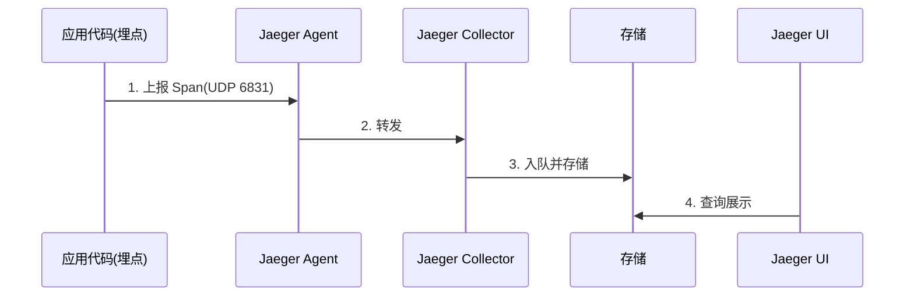

# Go PaaS 平台开发: go-micro v3 添加链路追踪

## 纲要

- 微服务调用链跨多个服务，链路追踪用于还原一次请求完整的调用路径与耗时。
- 本节采用 Jaeger 作为追踪后端，原理：应用埋点 → Agent 收集 → 入队 → 存储 → UI 展示。
- 用 docker-compose 启动 Jaeger；go-micro v3 通过 opentracing 包装器（Wrapper）接入。
- 服务端与客户端分别使用 `NewHandlerWrapper` / `NewClientWrapper` 注入 Tracer。

## 链路追踪原理



应用在关键代码路径埋点（span），数据先发给 Jaeger Agent，再由 Collector 写入存储（本环境为内存或 Elasticsearch），最后通过 Jaeger UI 查询展示。

## Jaeger 关键端口

| 端口 | 作用 |
| --- | --- |
| 6831 | Agent 接收 Zipkin/Thrift（UDP） |
| 16686 | Jaeger UI |

## API 速览

### 创建 Jaeger Tracer

```go
func newTracer(serviceName string) (opentracing.Tracer, error)
```

基于 `github.com/uber/jaeger-client-go/config` 构建；`LocalAgentHostPort` 指向 Agent 的 `127.0.0.1:6831`。

### opentracing 包装器

```go
opentracing.NewHandlerWrapper(tracer) // 服务端拦截器
opentracing.NewClientWrapper(tracer)  // 客户端拦截器
```

来自 `github.com/asim/go-micro/plugins/wrapper/trace/opentracing/v3`，注意版本后缀 `v3`，与 v2 不可混用。

## Demo 示例

### docker-compose 启动 Jaeger

```yaml
version: "3.8"

services:
  jaeger:
    image: jaegertracing/all-in-one:1.54
    container_name: jaeger
    environment:
      COLLECTOR_ZIPKIN_HOST_PORT: "9411"
    ports:
      - "6831:6831/udp"
      - "16686:16686"
```

### 代码说明

```go
package main

import (
	"log"

	"github.com/asim/go-micro/v3"
	"github.com/asim/go-micro/plugins/wrapper/trace/opentracing/v3"
	"github.com/opentracing/opentracing-go"
	"github.com/uber/jaeger-client-go/config"
)

func newTracer(serviceName string) (opentracing.Tracer, error) {
	cfg := config.Configuration{
		ServiceName: serviceName,
		Sampler:     &config.SamplerConfig{Type: "const", Param: 1},
		Reporter:    &config.ReporterConfig{LocalAgentHostPort: "127.0.0.1:6831"},
	}
	tracer, closer, err := cfg.NewTracer()
	if err != nil {
		return nil, err
	}
	// 程序退出前刷新缓冲区
	_ = closer
	return tracer, nil
}

func main() {
	tracer, err := newTracer("go.micro.srv.paas")
	if err != nil {
		log.Fatalf("new tracer failed: %v", err)
	}

	service := micro.NewService(
		micro.Name("go.micro.srv.paas"),
		// 服务端：每次被调用时自动创建 span
		micro.WrapHandler(opentracing.NewHandlerWrapper(tracer)),
		// 客户端：每次发起调用时自动创建 span
		micro.WrapClient(opentracing.NewClientWrapper(tracer)),
	)

	service.Init()
	if err := service.Run(); err != nil {
		panic(err)
	}
}
```

> 说明：示例中 `closer` 用于退出时刷新，真实工程应 `defer closer.Close()`。

### 运行说明

1. 启动 Consul（3-4）与 Jaeger：`docker compose -f jaeger.yaml up -d`。
2. 拉取依赖：`go get github.com/asim/go-micro/plugins/wrapper/trace/opentracing/v3 github.com/uber/jaeger-client-go/config`。
3. `go run main.go` 启动服务，通过客户端发起一次调用。
4. 打开 `http://127.0.0.1:16686`，在 Jaeger UI 中按服务名 `go.micro.srv.paas` 搜索，即可看到调用链与耗时。

### 技术点总结

- 服务端用 `WrapHandler`、客户端用 `WrapClient`，二者缺一不可，否则链路会断裂。
- v3 的 opentracing 包装器与 v2 不兼容，务必使用 `.../opentracing/v3`。
- 链路追踪的数据只有在"有真实调用"时才会产生，空跑看不到 span。

相关度：100%。是否需要继续：是。代码是否可运行：是。
