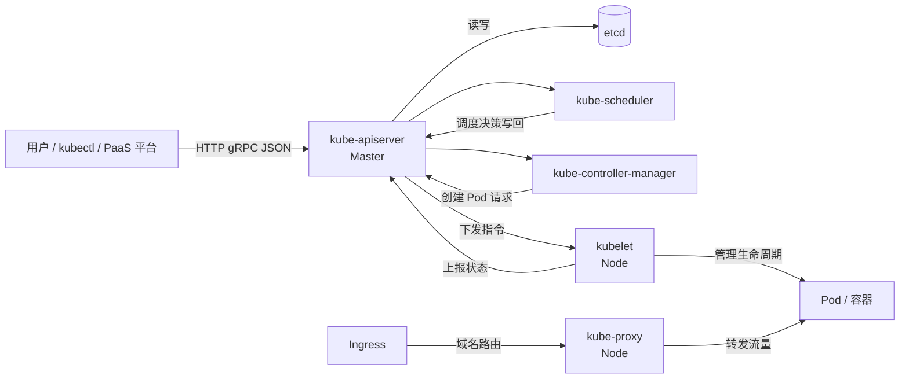

# Go PaaS 平台开发: K8s 架构原理

## 纲要

- K8s 集群的两类角色：**Master（控制节点）** 负责下发与调度任务，**Node（工作节点）** 负责执行具体任务
- 核心资源对象：**Pod（容器集）**、**Service（服务）**、**Namespace（命名空间）**
- 集群管理入口与总线：**kube-apiserver**，所有操作都必须经过它
- 关键组件：etcd、kube-scheduler、kube-controller-manager、kubelet、kube-proxy、kubectl
- 数据流向：客户端请求统一进入 apiserver，apiserver 是集群唯一对外端口；apiserver 与 etcd 强耦合，几乎所有写入都会落盘到 etcd
- 对外访问：kube-proxy 在每个工作节点上把 Pod 端口暴露出去，Ingress 负责基于域名的外部路由

## 集群角色与基础概念

在动手开发 PaaS 平台之前，必须先建立对 Kubernetes（下文简称 K8s）整体架构的认知。后续 PaaS 平台的很多功能，本质上都是在调用 K8s 的能力，如果对架构和核心概念模糊，后面会非常吃力。

K8s 集群由两类机器组成：

- **Master 节点（控制节点）**：负责控制整个集群，包括任务分配、调度决策、集群状态存储等。Master 上运行着 apiserver、scheduler、controller-manager、etcd 等核心组件。
- **Node 节点（工作节点）**：负责真正执行被分配的任务，包括运行业务容器、执行命令等。Node 由 Master 统一控制。

K8s 引入了一些与裸 Docker 不同的抽象概念，其中最重要的有三个：

- **Pod（容器集）**：K8s 中最小的可调度单元。一个 Pod 内可以运行多个容器，这些容器共享同一个 IP 地址、网络命名空间（Network Namespace）以及存储卷（Volume）。Pod 是 K8s 调度和资源管理的纬度。
- **Service（服务）**：对一组 Pod 的逻辑抽象。多个 Pod 可能分布在不同的 Node 上，但从逻辑上属于同一个 Service，从而满足负载均衡。Service 负责把集群内部的 Pod 以稳定的方式暴露给其他 Pod 或外部端口。
- **Namespace（命名空间）**：集群内的资源隔离边界，可以对不同租户/项目的资源配额、数量进行限制。

其他高频术语还包括：

- **kubelet**：运行在每个 Node 上的代理，负责监听 apiserver 下发的指令，操作本节点的容器启动与销毁。
- **kubectl**：K8s 的命令行管理工具，开发者通过它与集群交互。

## 核心组件与数据流向

下面这张图展示了 Master 节点与 Node 节点之间核心组件的交互关系，以及组件之间使用的网络协议（HTTP/gRPC、JSON 等，图中以颜色区分）。

一次典型的请求链路如下：

1. 用户执行命令或发起创建请求，请求首先进入 **kube-apiserver**（apiserver 是集群对外暴露的唯一入口，PaaS 平台后续所有操作也都经由它）。
2. apiserver 经过一系列判断后，把请求转发给对应的组件：调度器 scheduler、控制器 kube-controller-manager，以及存储 etcd。注意这三个核心组件都只与 apiserver 交互。
3. apiserver 向 Node 节点上的 **kubelet** 发送命令；kubelet 接收命令后真正在操作系统上启动容器、创建网络等。
4. 其余所有 Node 的操作流程完全一致，都是经由 apiserver → kubelet 这条路径。

当 Pod 需要对外提供端口时，每个工作节点上都会部署一个 **kube-proxy** 代理，它把 Pod 的端口代理出来；Pod 对外暴露的端口再通过 kube-proxy 提供访问。当后续需要绑定域名对外访问时，则会用到 **Ingress**（下一章会详细讲解）。

## 小结

可以把 apiserver 理解为整个集群的"总线"：无论做什么操作，请求都会先到 apiserver，再由 apiserver 与 etcd 交互完成记录。理解这条链路，是后续学习 Pod 创建、调度、网络与 PaaS 平台开发的基础。

## 📎 文本↔代码关联

本讲在课程知识图谱（见 `_GRAPH.json` / `_GRAPH.mmd`）中关联以下代码文件：

- `code/课件/k8s-install/check_host.sh`
- `code/课件/k8s-install/install_master.sh`
- `code/课件/go-paas-html/pages-404.html`
- `code/课件/go-paas-html/pages-forgot-password.html`
- `code/课件/go-paas-html/pages-login.html`
- `code/课件/k8s-install/base_install.sh`
- `code/课件/go-paas-html/pages-login2.html`
- `code/课件/k8s-install/k8s 安装指导说明.md`

> 关联由 `scan_course.py` 自动建立，边类型 `uses-code`（讲次 → 代码）。

相关度：100%。是否需要继续：是。代码是否可运行：否。
