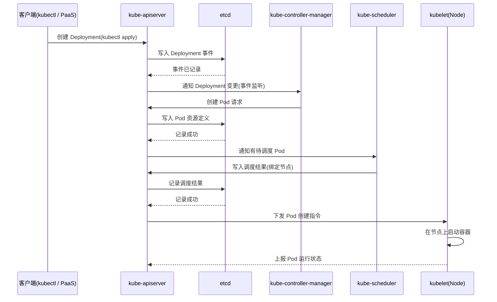

# Go PaaS 平台开发: APIServer 架构原理

## 纲要

- kube-apiserver 是集群管理的**唯一入口**，PaaS 平台对集群的所有操作都经由它
- 核心组件总览：apiserver、kube-controller-manager、kube-scheduler、etcd、kubelet、kube-proxy
- apiserver 的分层：API 层（核心 API / 聚合 API / 健康检查 / 日志 / 指标）、访问控制层（认证、授权、准入）
- **资源创建并非即时**：一次 Pod 创建请求会经过 "客户端 → apiserver → etcd → controller-manager → scheduler → etcd → kubelet" 的链式流转
- apiserver 是事实上的"总线"，几乎所有写操作都会落到 etcd

## 核心组件一览

在深入 apiserver 之前，先对 K8s 的核心组件建立统一认知：

| 组件 | 角色 |
| --- | --- |
| kube-apiserver | 集群管理入口，对外暴露唯一 REST/gRPC 端口 |
| kube-controller-manager | 管理控制中心，内含众多 controller（副本、节点、服务、资源配额等） |
| kube-scheduler | 调度器，决定 Pod 被放到哪个 Node 上运行 |
| etcd | 分布式键值存储，保存集群所有重要状态与元数据 |
| kubelet | 运行在每一个 Node 上的代理，负责执行 apiserver 下发的指令、管理 Pod 生命周期 |
| kube-proxy | 运行在 Node 上的网络代理，负责把 Pod 暴露给集群内外 |

面试中如果被问到是否会用 K8s，kubelet、kube-proxy 这类"运行在每个节点上的组件"是高频考点，需要清楚它们各自的作用。

## APIServer 的架构分层

apiserver 在内部可以划分为两层：

- **API 层**：提供核心 API、聚合（Aggregation）相关 API、健康检查 API，以及日志、性能指标、调度算法相关的对外服务。
- **访问控制层**：负责认证（Authentication）、授权（Authorization，如 RBAC 的鉴权算法）、准入控制（Admission）。其中维护着各类资源的注册表（Registry），比如 Controller 注册表、CRD 注册表等，所有注册信息都存放在 apiserver 的聚合查询层中。

这只是 apiserver 的整体架构轮廓，理解"所有请求都先过访问控制层、再落到 API 层处理"即可。

## 一次资源创建的完整生命周期

理解 apiserver，最关键的是搞清楚 **"创建一个 Pod 时，请求在集群内部是如何流转的"**。它绝不是"请求一到 apiserver 就立刻创建容器"，而是经历了一连串的事件监听与状态同步。

逐步拆解：

1. 客户端通过 `kubectl` 创建一个资源（例如 Deployment / Pod），请求进入 **apiserver**。
2. apiserver 把该请求写入 **etcd** 完成持久化，并随即把事件通知给对应的 **controller-manager**。
3. controller-manager 监听到事件后，发起"创建 Pod"的请求，再次经过 apiserver。
4. apiserver 把 Pod 定义记录到 **etcd**；记录成功后，把"待调度"事件通知给 **scheduler**。
5. scheduler 进行调度计算，选出目标节点，把调度结果写回 apiserver，apiserver 再写入 **etcd**。
6. apiserver 最终把创建指令下发给目标节点上的 **kubelet**，kubelet 才真正在节点上把容器启动起来。

可以看到，整个流程中**每一步几乎都要与 apiserver 交互**，而 apiserver 又不断与 etcd 同步状态——二者几乎不可分离。把这条链路彻底吃透，不仅有助于后续 PaaS 平台开发，也是在技术面试中体现深度的关键。

## 📎 文本↔代码关联

本讲在课程知识图谱（见 `_GRAPH.json` / `_GRAPH.mmd`）中关联以下代码文件：

- `code/课件/k8s-install/check_host.sh`
- `code/课件/k8s-install/install_master.sh`
- `code/课件/go-paas-html/pages-404.html`
- `code/课件/go-paas-html/pages-forgot-password.html`
- `code/课件/go-paas-html/pages-login.html`
- `code/课件/k8s-install/base_install.sh`
- `code/课件/go-paas-html/pages-login2.html`
- `code/课件/k8s-install/k8s 安装指导说明.md`

> 关联由 `scan_course.py` 自动建立，边类型 `uses-code`（讲次 → 代码）。

相关度：100%。是否需要继续：是。代码是否可运行：否。
