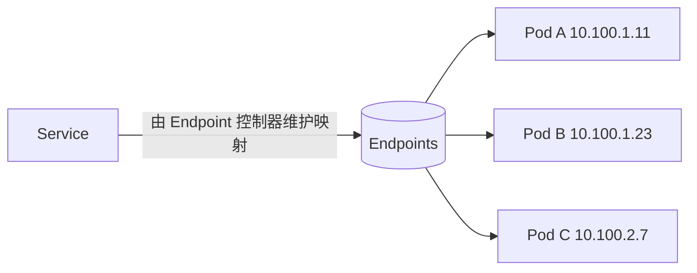
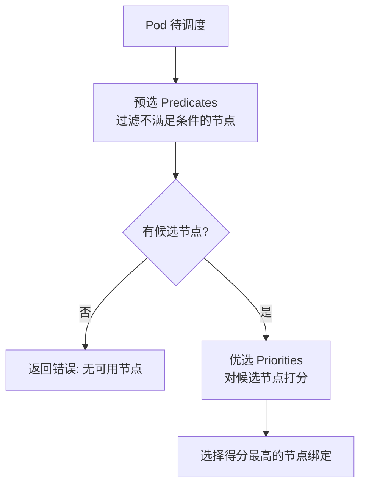

# Go PaaS 平台开发: Scheduler 调度器原理（下）

## 纲要

- **Endpoint 控制器**：维护 Service 与其后端 Pod IP 的映射关系，对使用者屏蔽负载均衡细节
- **kube-scheduler** 的职责：承接 controller 创建的 Pod，为其挑选并绑定目标 Node
- 调度分两步：**预选（Predicates）** → **优选（Priorities）**，必须先通过预选才能进入优选
- 常用预选策略：NoDiskConflict、PodFitsResources、PodMatchNodeSelector、HostName、PodFitsHost、端口冲突检查
- 常用优选策略：LeastRequested（最少资源消耗）、NodeLabel（节点标签）、基于备份节点的资源优选
- 调度器开放扩展点，开发者可自定义调度策略

## Endpoint 控制器

当一个集群内的应用要访问另一个应用时，默认是通过 **Service** 来访问的。Service 背后挂了很多 Pod 副本，但 Service 与这些 Pod 副本之间的映射关系，是由 **Endpoint 控制器** 负责记录和维护的。

Endpoint 控制器记录了每个 Service 下所有 Pod 的 IP 以及这些 Pod 分布在哪些节点上。正是有了它，Service 能够"透明"地把流量负载均衡到后端 Pod，而开发者在界面上几乎感知不到这层绑定关系——你随意扩容 Pod 副本，Endpoint 会自动把新 Pod 加进来。它是个"默默无闻但作用巨大"的组件，理解它往往是技术面试中的加分项。

## 调度器的工作流程

kube-scheduler 的核心职责是：**承接 controller 创建的 Pod，为其安排并绑定到目标 Node 上运行**。它本身不直接操作业务容器，而是把调度决策通过 apiserver 下发，由 kubelet 真正启动容器。

调度分为两个阶段，必须**先完成预选，再做优选**：

### 预选（Predicates）

预选阶段会过滤掉不满足条件的节点，官方默认包含以下策略（也可自定义）：

| 预选策略 | 作用 |
| --- | --- |
| NoDiskConflict | 待调度 Pod 所需的存储卷，在候选节点上不存在冲突 |
| PodFitsResources | 候选节点的 CPU/内存等资源能够满足 Pod 请求 |
| PodMatchNodeSelector | 候选节点包含 Pod 指定的节点标签选择器 |
| HostName / PodFitsHost | Pod 指定的 HostName 与候选节点一致（一般不去设置） |
| 端口冲突检查 | 候选节点上待绑定的主机端口未被占用（如 3232 端口同一时刻只能一个 Pod 绑定） |

其中 **节点标签选择器（NodeSelector）** 是日常最易用的精确调度手段：通过给节点打标签，可以让应用"精确地"只调度到目标机房/节点。例如某企业创建的 Pod 都希望落到自家机房，不会漂移到其他机房，就可以通过标签选择器来约束；若目标节点资源耗尽，即使其他节点空闲也不会调度过去。

### 优选（Priorities）

通过预选后，可能仍有多个候选节点，优选阶段会对它们打分，挑选最合适的一个：

- **LeastRequested（最少资源消耗优先）**：从候选节点中挑选资源消耗更小的节点，使整个集群各节点的负载趋于均衡（像一桶水最终趋于水平）。
- **NodeLabel（节点标签）**：根据节点标签进行优选，例如优先选择带"备份节点"标签的节点。
- **备份节点资源优选**：从备份节点中选出资源占用最小的节点，该策略通常与第一条共同作用，不能单独使用。

K8s 还允许开发者编写自定义调度策略并注入调度器，满足特定业务（如云边协同、异构硬件调度）的需求。

## 📎 文本↔代码关联

本讲在课程知识图谱（见 `_GRAPH.json` / `_GRAPH.mmd`）中关联以下代码文件：

- `code/课件/k8s-install/check_host.sh`
- `code/课件/k8s-install/install_master.sh`
- `code/课件/go-paas-html/pages-404.html`
- `code/课件/go-paas-html/pages-forgot-password.html`
- `code/课件/go-paas-html/pages-login.html`
- `code/课件/k8s-install/base_install.sh`
- `code/课件/go-paas-html/pages-login2.html`
- `code/课件/k8s-install/k8s 安装指导说明.md`

> 关联由 `scan_course.py` 自动建立，边类型 `uses-code`（讲次 → 代码）。

相关度：100%。是否需要继续：是。代码是否可运行：否。
