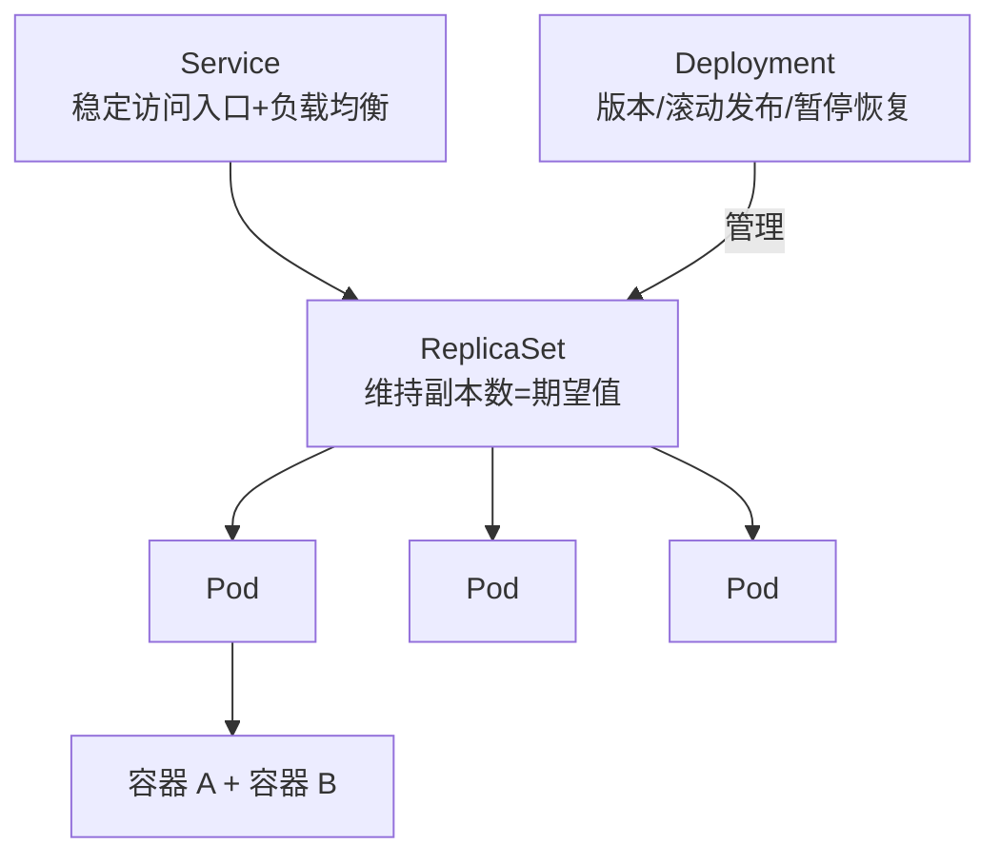

# Go PaaS 平台开发: Service Deployment Pod 的关系

## 纲要

- **Pod**：最小调度单元，一个 Pod 内可运行多个容器，所有 Pod 组成一个统一的逻辑单元
- **ReplicaSet**：保证 Pod 副本数量始终等于期望值，缺失则自动补齐
- **Deployment**：构建在 ReplicaSet 之上，额外提供版本管理、状态/事件查看、暂停/恢复、滚动发布与回滚
- **Service**：对一组 Pod 的逻辑抽象，提供稳定的访问入口与负载均衡
- 四者关系：Pod 被 ReplicaSet 维持数量，ReplicaSet 被 Deployment 管理，Service 把多个 Pod 暴露为统一服务

## 四者之间的关系

在 K8s 中，Pod、ReplicaSet、Deployment、Service 是日常接触最频繁的四个对象。它们各司其职、层层封装：



### Pod

Pod 是 K8s 中最小的可调度单元，官方支持在一个 Pod 内运行多个容器，这些容器共享网络与存储。所有 Pod 共同组成一个统一的对外服务单元。

### ReplicaSet

ReplicaSet（副本集）负责**维持 Pod 的副本数量**。当声明期望副本数为 3，而因异常只剩 2 个时，它会把缺失的那个 Pod 在资源充足的节点上重新拉起，使其恢复到期望值。它的职责"仅此而已"——保证数量正确，但不关心版本与发布过程。

### Deployment

Deployment 是**构建在 ReplicaSet 之上**的更高层抽象。它在副本管理的基础上，提供了 ReplicaSet 本身不具备的能力：

- **事件查看与状态查看**：随时观察发布进度与 Pod 状态；
- **版本管理**：每次更新都会记录版本，支持回滚到历史版本；
- **暂停与恢复**：升级过程中可随时暂停、随时继续；
- **多种升级方案**：滚动发布、重新删除再发布等，都可以通过 Deployment 实现。

```yaml
apiVersion: apps/v1
kind: Deployment
metadata:
  name: nginx-deploy
spec:
  replicas: 3
  selector:
    matchLabels:
      app: nginx
  template:
    metadata:
      labels:
        app: nginx
    spec:
      containers:
      - name: nginx
        image: nginx:1.25
```

### Service

Service 是对一组 Pod 的**逻辑抽象与稳定入口**。Pod 的 IP 会随着重建而变化，但 Service 提供固定的访问地址，并自动把流量负载均衡到其后端的所有 Pod。正是 Service + Endpoint 控制器（见上一节）的配合，让上层应用无需关心 Pod 具体落在哪台机器上。

```yaml
apiVersion: v1
kind: Service
metadata:
  name: nginx-svc
spec:
  selector:
    app: nginx
  ports:
  - port: 80
    targetPort: 80
  type: ClusterIP
```

## 小结

可以把这条关系链理解为：**Deployment 管"怎么发版本"，ReplicaSet 管"要有几个"，Pod 管"真正跑什么"，Service 管"别人怎么访问"**。下一节我们将基于这套关系，动手安装 K8s 集群。

## 📎 文本↔代码关联

本讲在课程知识图谱（见 `_GRAPH.json` / `_GRAPH.mmd`）中关联以下代码文件：

- `code/课件/k8s-install/check_host.sh`
- `code/课件/k8s-install/install_master.sh`
- `code/课件/go-paas-html/pages-404.html`
- `code/课件/go-paas-html/pages-forgot-password.html`
- `code/课件/go-paas-html/pages-login.html`
- `code/课件/k8s-install/base_install.sh`
- `code/课件/go-paas-html/pages-login2.html`
- `code/课件/k8s-install/k8s 安装指导说明.md`

> 关联由 `scan_course.py` 自动建立，边类型 `uses-code`（讲次 → 代码）。

相关度：100%。是否需要继续：是。代码是否可运行：否。
