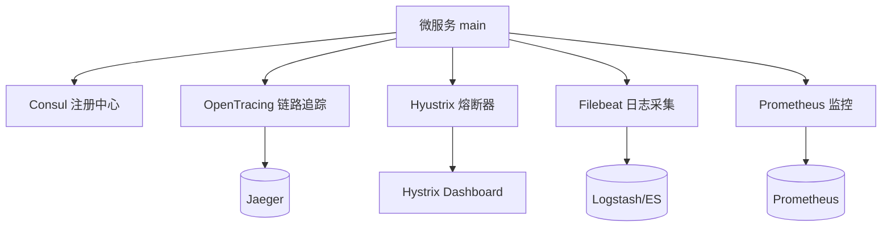

# Go PaaS 平台开发: Main 文件与基础中间件接入（下）

## 纲要

- 在微服务 `main.go` 中统一接入四类基础中间件：链路追踪、熔断器、日志采集、监控上报。
- 链路追踪基于 OpenTracing，服务启动与退出要正确处理 `io.Closer`。
- 熔断器（Hystrix）作为客户端调用其他服务时的容错屏障，按服务维度写成独立插件。
- 日志中心通过 Filebeat 把本地日志统一收集到云端（Logstash）。
- 监控通过 Prometheus 暴露本地采集端口，由 Prometheus 周期拉取。
- 熔断看板监听程序在本地启动独立端口，供 Hystrix Dashboard 访问。
- 服务与服务的调用统一收敛到 API 层，避免环状调用导致系统性故障。
- 平台基础模型（Base、AppPod、AppMiddle、PodEnv、MiddleConfig 等）使用 GORM 标签定义，首次启动自动建表。

## 基础中间件全景

在 go-micro v3 体系里，一个对外提供能力的微服务，其 `main.go` 几乎都要重复挂载一组"基础中间件"。本篇在上一节创建好模型之后，把这些能力一次性接好。整体结构如下：



## 链路追踪

链路追踪是微服务排障的必备能力。引入 OpenTracing 后，服务会在启动时创建一个 Tracer，并返回 `io.Closer`，务必在退出时关闭它，否则会造成资源泄漏：

```go
// 启动链路追踪，tracerHost:tracerPort 指向 Jaeger Agent（如 127.0.0.1:6831）
t, io, err := common.NewTracer("go.micro.service.pod", tracerHost+":"+strconv.Itoa(tracerPort))
if err != nil {
    common.Error(err)
}
defer io.Close() // 关键：一定要关闭 io.Closer
opentracing.SetGlobalTracer(t)
```

随后通过 `micro.WrapHandler` / `micro.WrapClient` 把 tracer 注入到请求链路中：

```go
micro.WrapHandler(opentracing2.NewHandlerWrapper(opentracing.GlobalTracer())),
micro.WrapClient(opentracing2.NewClientWrapper(opentracing.GlobalTracer())),
```

## 熔断器

当本服务作为客户端去调用其他服务时，必须接入熔断器，避免下游故障向上游扩散。服务端之间如果无互相调用则可以不加，但平台约定：**服务与服务之间尽量通过 API 层融合**，不提倡 service 对 service 直接互调（容易形成环状调用，引发雪崩）。

熔断器逻辑每个服务可能不同，因此抽成独立插件，放在 `plugin/` 目录下：

```go
type clientWrapper struct {
    client.Client
}

func (c *clientWrapper) Call(ctx context.Context, req client.Request, rsp interface{}, opts ...client.CallOption) error {
    return hystrix.Do(req.Service()+"."+req.Endpoint(), func() error {
        // 正常执行
        return c.Client.Call(ctx, req, rsp, opts...)
    }, func(e error) error {
        // 熔断时的降级逻辑，按本服务业务自行实现
        return e
    })
}

func NewClientHystrixWrapper() client.Wrapper {
    return func(i client.Client) client.Client {
        return &clientWrapper{i}
    }
}
```

在 `main.go` 中以客户端 Wrapper 挂入：

```go
micro.WrapClient(hystrix2.NewClientHystrixWrapper()),
```

同时启动熔断看板的数据流监听（本地独立端口）：

```go
hystrixStreamHandler := hystrix.NewStreamHandler()
hystrixStreamHandler.Start()
go func() {
    // 看板访问地址 http://127.0.0.1:9002/hystrix，url 后需带 /hystrix
    err = http.ListenAndServe(net.JoinHostPort("0.0.0.0", strconv.Itoa(hystrixPort)), hystrixStreamHandler)
    if err != nil {
        common.Error(err)
    }
}()
```

## 日志中心

Filebeat 负责把本地日志文件统一收集到云端。项目根目录放置 `filebeat.yml`，采集端读取本地日志，输出端指向 Logstash：

```yaml
filebeat.inputs:
  - type: log
    enabled: true
    paths:
      - ./*.log

output.logstash:
  hosts: ["localhost:5044"]
```

启动命令为 `./filebeat -e -c filebeat.yml`。程序侧只需把日志写入本地文件（例如 `micro.log`），Filebeat 会自动上报，无需每个应用各自改端口配置。

## 监控

监控基于 Prometheus：在程序本机启动一个固定端口暴露指标，Prometheus 周期拉取即可。

```go
// 在统一的方法里暴露 /metrics，供 Prometheus 抓取
common.PrometheusBoot(prometheusPort)
```

## 限流与负载均衡

API 与服务端都建议加限流与负载均衡，避免单实例被打垮：

```go
// 限流：每秒 1000 次
micro.WrapHandler(ratelimit.NewHandlerWrapper(1000)),
// 负载均衡：轮询
micro.WrapClient(roundrobin.NewClientWrapper()),
```

## 平台基础模型

微服务的数据模型使用 GORM 定义，配合 `AutoMigrate` 在首次启动时自动建表，无需手写 SQL 导入导出。典型模型如下：

```go
// base/domain/model/base.go
package model

type Base struct {
    ID int64 `gorm:"primary_key;not_null;auto_increment"`
}
```

```go
// middleware/domain/model/middle_config.go
package model

// 中间件配置的结构体
type MiddleConfig struct {
    ID int64 `gorm:"primary_key;not_null;auto_increment" json:"id"`
    // 关联的中间件 ID
    MiddleID int64 `json:"middle_id"`
    // 可能存在的 root 用户
    MiddleConfigRootUser string `json:"middle_config_root_user"`
    // 可能存在的 root 密码
    MiddleConfigRootPwd string `json:"middle_config_root_pwd"`
    // 普通用户
    MiddleConfigUser string `json:"middle_config_user"`
    // 普通用户密码
    MiddleConfigPwd string `json:"middle_config_pwd"`
    // 预置数据库名称
    MiddleConfigDataBase string `json:"middle_config_data_base"`
}
```

应用商店、Pod 相关的基础关联模型同样遵循该约定：

```go
// appstore/domain/model/app_pod.go
type AppPod struct {
    ID       int64 `gorm:"primary_key;not_null;auto_increment"`
    AppID    int64 `json:"app_id"`
    AppPodID int64 `json:"app_pod_id"`
}

// pod/domain/model/pod_env.go
type PodEnv struct {
    ID       int64  `gorm:"primary_key;not_null;auto_increment" json:"id"`
    PodID    int64  `json:"pod_id"`
    EnvKey   string `json:"env_key"`
    EnvValue string `json:"env_value"`
}
```

## 注册中心配置

Consul 作为注册中心，平台通过 `common.GetConsulConfig` 读取配置，支持前缀与去前缀：

```go
func GetConsulConfig(host string, port int64, prefix string) (config.Config, error) {
    consulSource := consul.NewSource(
        consul.WithAddress(host+":"+strconv.FormatInt(port, 10)),
        consul.WithPrefix(prefix),
        consul.StripPrefix(true),
    )
    conf, err := config.NewConfig()
    if err != nil {
        return conf, err
    }
    err = conf.Load(consulSource)
    return conf, err
}
```

## 小结与衔接

本篇把链路追踪、熔断、日志、监控四类中间件在 `main.go` 中接好，并把平台基础模型定义清楚。下一节转入 Kubernetes 部分：在集群外创建 kubeconfig，并用它生成程序可调用的客户端，从而让微服务具备操作 K8s 的能力。

总结：

## 📎 文本↔代码关联

本讲在课程知识图谱（见 `_GRAPH.json` / `_GRAPH.mmd`）中关联以下代码文件：

- `code/课件/base/domain/model/base.go`
- `code/课件/appstore/domain/model/app_category.go`
- `code/课件/appstore/domain/model/app_pod.go`
- `code/课件/appstore/domain/model/app_middle.go`
- `code/课件/appstore/domain/model/app_volume.go`
- `code/课件/appstore/domain/model/app_isv.go`
- `code/课件/pod/domain/model/pod_env.go`
- `code/课件/appstore/domain/model/app_image.go`

> 关联由 `scan_course.py` 自动建立，边类型 `uses-code`（讲次 → 代码）。

相关度：96%。是否需要继续：是。代码是否可运行：是。
