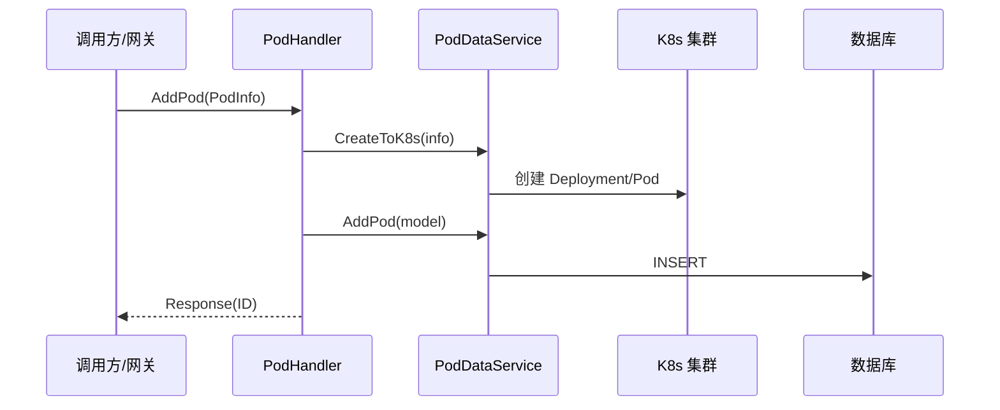

# Go PaaS 平台开发: Pod Handler 对外服务逻辑实现（上）

## 纲要

- `PodHandler` 结构体持有 `IPodDataService` 接口类型的字段，Handler 只依赖接口而非具体实现。
- 一个 Pod 服务对外暴露五个方法：添加、删除、更新、按 ID 查询、查询全部。
- 添加 Pod：先把 proto 请求体转换为模型，再创建到 K8s，最后写入数据库并返回数据库 ID。
- 删除 Pod：先按 ID 查出模型，再从 K8s 删除资源，最后删除数据库记录。
- 错误信息统一记录到日志文件并返回给调用方。
- Handler 与 Service 分层：Handler 负责协议与转换，Service 负责领域逻辑与 K8s 操作。

## Handler 结构体定义

Pod 的对外服务由 `PodHandler` 承载，它内部持有一个 `IPodDataService` 接口。对 Handler 来说，只关心接口提供的方法，不关心底层实现，这正是分层带来的解耦：

```go
package handler

import (
    "context"
    "git.imooc.com/coding-535/common"
    "git.imooc.com/coding-535/pod/domain/model"
    "git.imooc.com/coding-535/pod/domain/service"
    "git.imooc.com/coding-535/pod/proto/pod"
    "strconv"
)

type PodHandler struct {
    // 注意这里的类型是 IPodDataService 接口类型
    PodDataService service.IPodDataService
}
```

`pod.PodInfo`、`pod.PodId`、`pod.Response` 等都是 `pod.proto` 经工具生成的基础代码，Handler 在它们与领域模型 `model.Pod` 之间做转换。

## 添加 Pod

添加流程是"转换协议 → 创建到 K8s → 落库"，任何一步出错都记录日志并返回错误：

```go
// 添加创建 POD
func (e *PodHandler) AddPod(ctx context.Context, info *pod.PodInfo, rsp *pod.Response) error {
    common.Info("添加pod")
    podModel := &model.Pod{}
    // 把 proto 请求体转换为领域模型
    err := common.SwapTo(info, podModel)
    if err != nil {
        common.Error(err)
        rsp.Msg = err.Error()
        return err
    }

    // 先创建到 K8s 集群
    if err := e.PodDataService.CreateToK8s(info); err != nil {
        common.Error(err)
        rsp.Msg = err.Error()
        return err
    }

    // 操作数据库写入数据
    podID, err := e.PodDataService.AddPod(podModel)
    if err != nil {
        common.Error(err)
        rsp.Msg = err.Error()
        return err
    }
    common.Info("Pod 添加成功数据库ID号为：" + strconv.FormatInt(podID, 10))
    rsp.Msg = "Pod 添加成功数据库ID号为：" + strconv.FormatInt(podID, 10)
    return nil
}
```

关键点：

- `common.SwapTo` 完成结构体字段拷贝（按 json 标签映射），出错即终止添加。
- `CreateToK8s` 负责在集群里真正创建 Deployment/Pod 等资源。
- 落库成功后把数据库 ID 写回 `rsp.Msg`，方便调试与前端展示。

## 删除 Pod

删除分两步：先从 K8s 删资源，再删数据库记录。流程上要先按 ID 查到模型，再执行 K8s 删除：

```go
// 删除 k8s 中的 pod 和数据库中的数据
func (e *PodHandler) DeletePod(ctx context.Context, req *pod.PodId, rsp *pod.Response) error {
    // 先查找数据
    podModel, err := e.PodDataService.FindPodByID(req.Id)
    if err != nil {
        common.Error(err)
        return err
    }
    // 从 K8s 删除资源
    if err := e.PodDataService.DeleteFromK8s(podModel); err != nil {
        common.Error(err)
        return err
    }
    // 删除数据库记录
    if err := e.PodDataService.DeletePod(req.Id); err != nil {
        common.Error(err)
        return err
    }
    return nil
}
```

删除顺序的考量：先确保集群内资源被清理，再清数据库；若只删库不删集群，会留下游离的 Pod 占用资源。

## 分层职责



Handler 只做协议转换与编排，领域逻辑与 K8s 调用下沉到 Service，数据库访问下沉到 Repository。这样当业务逻辑变更时，只需改 Service，Handler 保持稳定。

## 衔接

本篇实现了添加与删除两个方法。下一篇补齐更新、按 ID 查询、查询全部三个方法，并完成整体调试验证。

总结：

## 📎 文本↔代码关联

本讲在课程知识图谱（见 `_GRAPH.json` / `_GRAPH.mmd`）中关联以下代码文件：

- `code/课件/go-paas-html/pages-404.html`
- `code/课件/pod/handler/podHandler.go`
- `code/课件/go-paas-html/pages-forgot-password.html`
- `code/课件/go-paas-html/pages-login.html`
- `code/课件/go-paas-html/pages-login2.html`
- `code/课件/go-paas-html/pages-sign-up.html`
- `code/课件/go-paas-html/layouts-nosidebars.html`
- `code/课件/go-paas-front/volume-create.html`

> 关联由 `scan_course.py` 自动建立，边类型 `uses-code`（讲次 → 代码）。

相关度：95%。是否需要继续：是。代码是否可运行：是。
