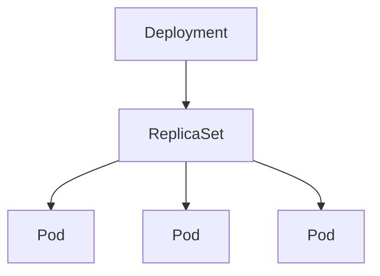
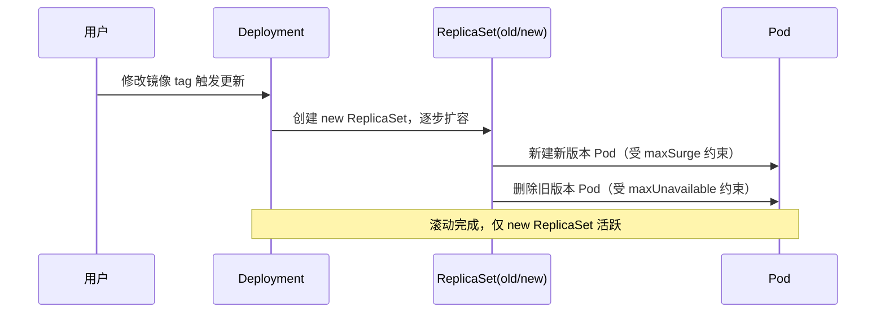
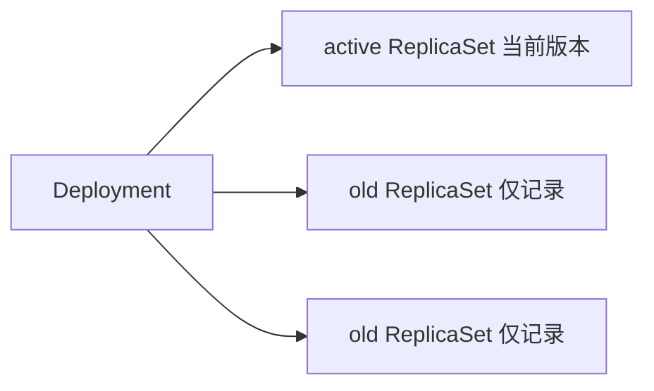

# Go PaaS 平台开发: Deployment 核心概念与滚动发布原理

## 纲要

- Deployment 的作用：声明期望副本数、管理发布策略、支持回滚
- Deployment、ReplicaSet、Pod 三者关系：Deployment 控制 ReplicaSet，ReplicaSet 控制 Pod
- 同步触发条件：Deployment 本身变更、关联的 ReplicaSet 变更、Pod 数量归零
- 滚动更新原理：`maxUnavailable` 与 `maxSurge` 两个核心参数
- 回滚机制：基于版本保存 ReplicaSet 记录，并不重建历史 Pod

## Deployment 是什么

在 Kubernetes（以下简称 K8s）中，应用的最终落地形态是 Pod，但 Pod 本身不具备自愈与发布能力。Deployment 是 K8s 中用于描述**无状态应用期望状态**的顶层资源，它处在整个应用管理链路的核心位置。所有基于 K8s 的应用开发都离不开 Deployment。

可以从三个角度理解 Deployment：

1. **作用**：定义一组期望运行的副本数量（Replicas），并交由控制器持续维持这一状态。例如声明期望副本数为 5，当某台物理机故障导致集群内只剩 4 个 Pod 时，控制器会在其他有资源的节点上重新调度起一个 Pod，直到重新达到 5 个。
2. **与其他资源的关系**：Deployment 与 ReplicaSet、Pod 之间存在明确的三层控制链。
3. **能做什么**：滚动更新（Rolling Update）、滚动发布、回滚等能力都由 Deployment 掌握。早期 K8s 使用 ReplicationController，功能单一，后续版本由 Deployment 接管，并通过控制 ReplicaSet 间接管理 Pod。

## Deployment 与 ReplicaSet、Pod 的关系

三者是逐级控制的关系，理解这张关系图是理解后续发布策略的前提：

- **Deployment** 不会直接创建或管理 Pod，它只管理 ReplicaSet 的版本与期望副本数。
- **ReplicaSet** 才是真正保证指定数量 Pod 运行的资源，它直接控制 Pod 的创建与销毁。
- **Pod** 是最終运行容器的载体。

早期直接使用的 ReplicationController 功能较单一，现代 K8s 统一由 Deployment 通过 ReplicaSet 间接管理 Pod。

## 同步触发条件

Deployment 控制器内部为三类资源各注册了一个监听器（Informer），任何增、删、改操作都会触发一次同步（reconcile）：

- Deployment 本身发生增加、更新、删除。
- 关联的 ReplicaSet 发生增加、更新、删除，会反向通知对应 Deployment 的控制器。
- 关联的 Pod 被删除、数量归零。Pod 数量为 0 这一信号也会被同步到 Deployment 控制器，等价于"停止该应用"。

这也解释了为什么直接删除 Pod 不会让应用真正消失——ReplicaSet 会立刻拉起新的 Pod 补足副本；要想停止应用，需要在 Deployment 层面将副本数调整为 0 或删除 Deployment。

## 滚动更新原理

Deployment 默认采用 `RollingUpdate` 策略进行滚动更新。更新过程中有两个关键参数：

| 参数 | 含义 |
| --- | --- |
| `maxUnavailable` | 更新期间允许处于不可用状态的 Pod 最大数量 |
| `maxSurge` | 在期望副本数基础上，允许额外创建的最大 Pod 数量 |

假设期望副本数为 5，`maxUnavailable` 设为 3、`maxSurge` 设为 2，更新时新 Pod 逐个创建，旧 Pod 逐个删除。在过渡阶段，可用 Pod 数量允许短暂下降（最多 3 个不可用），同时最多额外多出 2 个新 Pod，从而在保证业务可用的前提下平滑完成替换。

## 回滚机制

每个 Deployment 资源都带有版本（revision）概念，回滚就是基于这些历史版本进行的。需要注意两点：

1. **历史版本会越来越多**：频繁滚动发布会累积大量 revision，可以通过 `revisionHistoryLimit` 控制保留数量。
2. **只保存 ReplicaSet，不重建历史 Pod**：默认情况下，旧的 ReplicaSet 记录（以及其 Pod 模板）会被保留，但并不会真正创建其下的 Pod。原因有二：一是重建历史 Pod 非常耗费资源；二是跨多个版本共存可能导致数据不一致、业务逻辑混乱。

活跃的那个 ReplicaSet 下方挂载 0 到多个 Pod；历史 ReplicaSet 仅保留模板记录，便于需要时回滚。在 OpenShift 等管理界面上可以看到这些历史 ReplicaSet 记录。

## 总结

## 📎 文本↔代码关联

本讲在课程知识图谱（见 `_GRAPH.json` / `_GRAPH.mmd`）中关联以下代码文件：

- `code/课件/go-paas-html/pages-404.html`
- `code/课件/go-paas-html/pages-forgot-password.html`
- `code/课件/go-paas-html/pages-login.html`
- `code/课件/go-paas-html/pages-login2.html`
- `code/课件/go-paas-html/pages-sign-up.html`
- `code/课件/go-paas-html/layouts-nosidebars.html`
- `code/课件/go-paas-front/volume-create.html`
- `code/课件/go-paas-front/route-create.html`

> 关联由 `scan_course.py` 自动建立，边类型 `uses-code`（讲次 → 代码）。

相关度：100%。是否需要继续：是。代码是否可运行：否。
