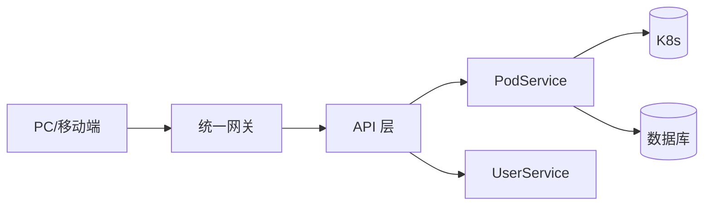

# Go PaaS 平台开发: PodAPI 工程目录与 proto 文件开发

## 纲要

- 整体架构：PC/移动端 → 统一网关 → API 层 → Service 层 → 数据库/K8s。
- API 层负责参数提取、预处理、鉴权，并编排调用各 Service，避免 Service 之间互相循环调用。
- 工程目录：`handler/`（对外 API）、`plugin/`（熔断等独立插件）、`proto/`（proto 定义）、`main.go`（入口）。
- `podApi.proto` 用 proto3 语法定义服务 `PodApi` 与消息 `Pair`/`Request`/`Response`。
- 默认接口 `Call`：访问 `/podApi/` 或 `/podApi/call` 时命中，常用于处理默认值。
- 用 `make proto`（cap-v3 工具）根据 proto 生成基础 Go 代码，再在其上开发 Handler。

## 为什么需要 API 层

PC 前端与移动端发起请求，先到达统一网关的固定地址；网关判断后转发到对应 API 层；API 层执行业务编排——决定调用哪个 Service（如 PodService、UserService），并在调用前后做参数提取、预处理与鉴权。



关键约定：

- Service 层专注单一领域，Service 之间**不建议来回互调**，否则易形成环状调用导致系统性雪崩。
- 跨服务的编排统一收敛到 API 层完成。
- API 层还能承接前端数据过滤、结构体装配，保护后端 Service 稳定，业务变更时只改 API 即可。

## 工程目录

手动创建（后续章节会用工程初始化工具自动生成，这里先把结构记熟）：

```dir
podApi/
├── handler/            # 对外暴露的 API 实现
│   └── podApiHandler.go
├── plugin/             # 独立插件（熔断等），逻辑与具体服务相关
│   └── hystrix/
│   └── form/
├── proto/              # proto 定义及生成代码
│   └── podApi/
│       ├── podApi.proto
│       ├── podApi.pb.go
│       └── podApi.pb.micro.go
├── main.go             # 服务入口，必不能少
├── go.mod
└── Makefile            # 简化 proto 生成/构建命令
```

模块名按网关约定命名，例如 `git.imooc.com/coding-535/podApi`（来自 `go.mod`）。

## 编写 proto 文件

`podApi.proto` 基于 proto3，定义对外暴露的五个 RPC 与一个默认接口：

```protobuf
syntax = "proto3";

package podApi;

option go_package = "./proto/podApi;podApi";

service PodApi {
    rpc FindPodById (Request) returns (Response) {}
    rpc AddPod(Request) returns (Response){}
    rpc DeletePodById(Request) returns (Response){}
    rpc UpdatePod(Request) returns (Response){}
    // 默认接口
    rpc Call(Request) returns (Response){}

}

message Pair {
    string key = 1;
    repeated string values = 2;
}

message Request {
    string method = 1;
    string path = 2;
    map<string, Pair> header = 3;
    map<string, Pair> get = 4;
    map<string, Pair> post = 5;
    string body = 6;
    string url = 7;
}

message Response {
    int32 statusCode = 1;
    map<string, Pair> header = 2;
    string body = 3;
}
```

要点说明：

- `Request` 承载 HTTP 请求的 method、path、header、get 参数、post 表单、body、url，几乎覆盖网关转发过来的全部信息。
- `Response` 用 `statusCode` + `header` + `body` 返回，是一个通用响应结构。
- `Pair` 用 `repeated string values` 表达同名多值（如多个端口、多个环境变量）。
- `Call` 是默认接口：当访问 `/podApi/`（不带方法名）或 `/podApi/call` 时命中，常用于返回默认值或兜底逻辑。

## 由 proto 生成基础代码

在 `podApi` 根目录执行（具体工具为课程提供的 cap-v3，等价于 `make proto`）：

```bash
make proto
```

执行后多出 `podApi.pb.go` 与 `podApi.pb.micro.go` 两个文件，前者是消息结构体，后者是服务接口的骨架。注意 proto 文件路径必须在根目录且相对路径正确，否则生成失败。Windows 下建议写绝对路径。

## 衔接

本篇建立工程目录并写好 `podApi.proto`。下一篇基于生成代码开发 `podApiHandler.go`，实现五个接口并接好后端 PodService。

总结：

## 📎 文本↔代码关联

本讲在课程知识图谱（见 `_GRAPH.json` / `_GRAPH.mmd`）中关联以下代码文件：

- `code/课件/podapi/proto/podApi/podApi.proto`
- `code/课件/podapi/proto/podApi/podApi.pb.micro.go`
- `code/课件/podapi/proto/podApi/podApi.pb.go`
- `code/课件/podapi/filebeat.yml`
- `code/课件/podapi/go.mod`
- `code/课件/svcapi/proto/svcApi/svcApi.proto`
- `code/课件/routeapi/proto/routeApi/routeApi.proto`
- `code/课件/volumeapi/proto/volumeApi/volumeApi.proto`

> 关联由 `scan_course.py` 自动建立，边类型 `uses-code`（讲次 → 代码）。

相关度：95%。是否需要继续：是。代码是否可运行：是。
