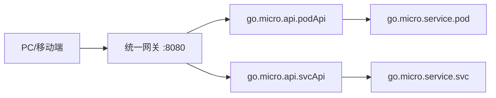

# Go PaaS 平台开发: 统一网关 cap-api-gateway 说明

## 纲要

- 统一网关位于前端与 API 层之间，所有外部请求先到网关，再由网关按路径转发到对应 API。
- 网关基于 go-micro v3 做了 v2 兼容改造，注册中心使用 Consul 1.9.11（1.10+ 不兼容，须注意版本）。
- 网关镜像：`cap1573/cap-api-gateway`，对外映射固定端口 `8080`。
- 启动命令：`docker run -d -p 8080:8080 cap1573/cap-api-gateway --registry=consul --registry_address=<consulIP>:8500 api --handler=api`。
- 路由原理：依约定路径前缀（如 `/podApi`）在 Consul 中找到 `go.micro.api.podApi`，再调用其内部方法。
- 源码开放，可在此基础上挂载其它服务的网关路由。

## 网关在架构中的位置



前端只需面向网关固定地址（如 `http://localhost:8080`）发请求，无需感知后端服务的具体地址与端口，服务治理、路由、跨域都由网关统一处理。

## 版本与依赖注意

| 组件 | 版本 | 说明 |
| --- | --- | --- |
| 微服务框架 | go-micro v3 | 网关做了 v2 兼容改造 |
| 注册中心 | Consul 1.9.11 | 1.10 及以上不兼容，须固定 1.9.x |
| 网关镜像 | `cap1573/cap-api-gateway` | 课程仓库提供的改造版镜像 |
| 对外端口 | 8080 | 统一映射端口 |

若网关需依赖其它插件，可自行在源码基础上安装扩展；核心改造点是 v2/v3 兼容与默认路由行为。

## 启动网关

镜像启动非常简单，把注册中心地址换成你实际的 Consul 地址：

```bash
docker run -d -p 8080:8080 \
  cap1573/cap-api-gateway \
  --registry=consul \
  --registry_address=<你的consulIP>:8500 \
  api --handler=api
```

- `-p 8080:8080`：把网关的统一入口映射到宿主机 8080。
- `--registry_address`：指向 Consul 所在机器的 IP 与 8500 端口（Consul 默认端口）。
- `api --handler=api`：以 API handler 模式启动，按路径转发。

启动后，Consul 控制台会多出网关相关记录；再启动 `podApi` 服务，网关即可通过 Consul 发现它。

## 路由原理

网关依据"约定好的路径前缀"做转发：

1. 前端请求 `/podApi/findPodById?pod_id=1` 到达网关 `:8080`。
2. 网关解析出子路径 `podApi`，在 Consul 中查找名为 `go.micro.api.podApi` 的服务。
3. 找到后，按路径与方法名调用该 API 内部对应的 Handler 方法。
4. Handler 内部已写明需要调用的后端 Service（如 `go.micro.service.pod`），完成真正的业务逻辑。

这种"前端 → 网关 → API → Service → K8s/数据库"的链路，是后续所有章节统一遵循的架构范式。

## 衔接

网关已能把请求转发到 `podApi`。下一篇完善 API 各接口的业务逻辑，并开发前端页面，打通"前端提交表单 → 网关 → API → Service → K8s 落库"的完整闭环。

总结：

## 📎 文本↔代码关联

本讲在课程知识图谱（见 `_GRAPH.json` / `_GRAPH.mmd`）中关联以下代码文件：

- `code/课件/go-paas-html/pages-404.html`
- `code/课件/go-paas-html/pages-forgot-password.html`
- `code/课件/go-paas-html/pages-login.html`
- `code/课件/go-paas-html/pages-login2.html`
- `code/课件/go-paas-html/pages-sign-up.html`
- `code/课件/go-paas-html/layouts-nosidebars.html`
- `code/课件/go-paas-front/volume-create.html`
- `code/课件/go-paas-front/route-create.html`

> 关联由 `scan_course.py` 自动建立，边类型 `uses-code`（讲次 → 代码）。

相关度：92%。是否需要继续：是。代码是否可运行：否。
