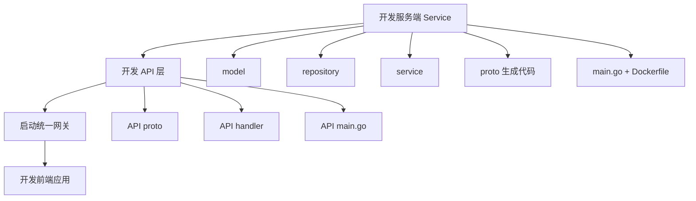
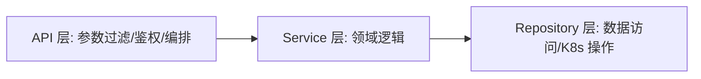

# Go PaaS 平台开发: 应用服务管理功能开发总结与思考

## 纲要

- 概念回顾：Deployment 与 Pod 的关系、Pod 重启策略与调度策略、一个 Pod 可放多个容器。
- 开发路径回顾：Service → API（proto + handler + main）→ 网关 → 前端 的完整链路。
- 核心经验：Pod 是云原生 PaaS 的最小调度单位；微服务必须分层，避免业务改造引发链路雪崩。
- 三个开放性思考题：Pod 多容器收益、网关跨域方案、Deployment 带来的好处。

## 概念回顾

- **Deployment 与 Pod**：Deployment 是 Pod 的抽象与管理层，声明期望副本数，由控制器维持实际状态。Pod 是 K8s 调度与运行的最小单位，一个 Pod 内可包含多个容器（边车、初始化容器等）。
- **重启策略**：Pod 支持 `Always` / `OnFailure` / `Never`，决定容器退出后的重启行为。
- **调度策略**：K8s 依据资源请求、亲和性、污点容忍等把 Pod 调度到合适节点；平台在创建应用时即可指定副本数与资源画像。

这些概念是开发 Pod 服务的前提，若仍模糊建议回到前面章节巩固，再继续动手。

## 开发路径回顾

本章完整的开发路径如下：

具体步骤：

1. **开发服务端**：用工程工具生成目录 → 写 model → 写 repository → 写 service → 写 proto 并用工具生成基础代码 → 写对外 Handler → 写 `main.go` → 打包 Docker。
   - 操作 K8s 的服务注意拷贝/挂载 `~/.kube/config`。
   - 注册中心、链路追踪地址写可达地址；熔断、监控端口要暴露映射。
   - 服务端口固定，并正确设置 `Advertise`。
2. **开发 API 层**：生成目录 → 写 API proto 并生成代码 → 写 API 接口 → 写 `main.go`（命名 `go.micro.api.xxx`）→ 打包。
3. **启动网关**：用 `cap-api-gateway` 镜像，端口 8080，把 Consul 地址替换为你自己的。
4. **开发前端**：HTML + jQuery 前后端分离，地址指向网关，完成列表/详情/创建/删除闭环。

## 核心经验

### Pod 是最小单位

在云原生 PaaS 中，用户"创建一个应用"实际是创建一个 Pod（及其 Deployment），而不是直接创建一个容器。K8s 管理与调度的最小单位是 Pod，理解这一点对资源建模至关重要。

### 必须分层

- 前端请求处理、数据过滤、业务判断下沉到 API 层。
- Service 层专注领域逻辑，Repository 层专注数据访问与 K8s 操作。
- 业务需求变更时只改 API，不动 Service，最大限度保证系统稳定，避免"改一个 bug 引发雪崩"。

## 三个开放性思考题

- **为什么 Pod 能放多个容器，好处是什么？**
  多个容器共享网络与存储命名空间，便于主容器 + 边车（日志采集、服务网格代理）协同，且一起调度、一起生命周期管理。

- **网关跨域如何解决？**
  前端页面直接用浏览器打开就能访问远端网关，看似"跨域"。实际跨域在网关源码中已做处理（CORS 设置），可阅读 `cap-api-gateway` 源码中的跨域配置。

- **Deployment 的设定带来哪些好处？**
  声明式期望状态、滚动更新、版本回滚、副本自愈，解耦了"期望"与"实际"，是生产可用的关键抽象。

## 衔接

本章打通了"应用服务管理（产品化创建资源）"的全链路。后续章节将用工程初始化工具自动生成目录，进一步加速后端服务开发。

总结：

## 📎 文本↔代码关联

本讲在课程知识图谱（见 `_GRAPH.json` / `_GRAPH.mmd`）中关联以下代码文件：

- `code/课件/go-paas-html/pages-404.html`
- `code/课件/go-paas-html/pages-forgot-password.html`
- `code/课件/go-paas-html/pages-login.html`
- `code/课件/go-paas-html/pages-login2.html`
- `code/课件/go-paas-html/pages-sign-up.html`
- `code/课件/go-paas-html/layouts-nosidebars.html`
- `code/课件/go-paas-front/volume-create.html`
- `code/课件/go-paas-front/route-create.html`

> 关联由 `scan_course.py` 自动建立，边类型 `uses-code`（讲次 → 代码）。

相关度：90%。是否需要继续：否。代码是否可运行：否。
