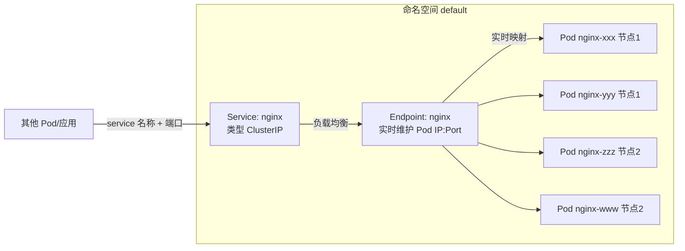
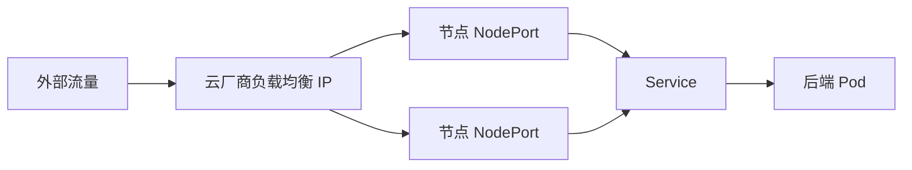
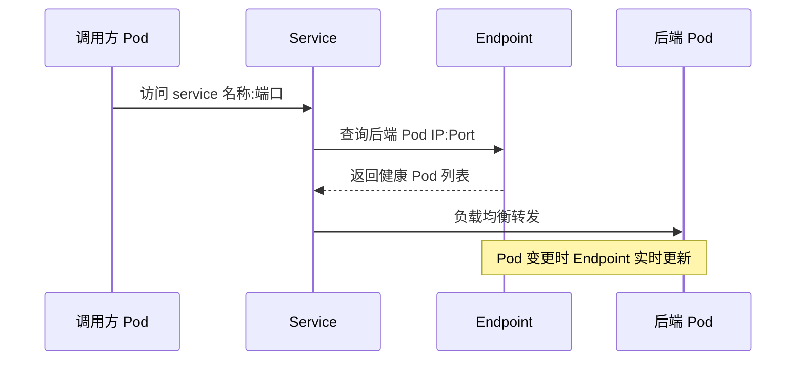

# Go PaaS 平台开发: Service 类型原理与 Service/Endpoint/Pod 关系

## 纲要

- Kubernetes `Service` 的本质：Pod 的逻辑分组与稳定访问入口
- 四种 Service 类型：`ClusterIP`、`NodePort`、`LoadBalancer`、`ExternalName` 的适用场景与端口差异
- `Service` 与 `Pod` 的关联机制：通过 `Label Selector` + `Endpoint` 实时维护后端地址
- `Deployment` 管 Pod 部署，`Service` 管 Pod 访问（两者是平行的抽象层）
- 平台侧如何用 Go 代码描述一个 Service：以 `svc.proto` 的 `SvcInfo` 与 `SvcDataService.setService` 为例

## Service 解决了什么问题

在没有 `Service` 的情况下，Pod 直接运行在节点上。一旦 Pod 被驱逐、调度或重建，它的 IP 与名称（带随机后缀）都会变化。如果应用里把 Pod 的 IP 或名称写死，网络就会中断。

`Service` 在 Pod 之上抽象出一层逻辑分组：

- 通过 `Service` 名称即可访问背后的一组 Pod，不必关心具体 Pod 的 IP。
- `Service` 默认自带负载均衡能力，把流量按轮询或随机策略转发到后端 Pod。
- Pod 宕机后，`Service` 通过 `Endpoint` 感知状态变化，自动把坏节点剔除，流量不再打到它上面。



## 四种 Service 类型

### ClusterIP

最常用的模式，也是本课程创建服务时默认采用的方式。它的特点是：

- 集群内部通过 DNS 名称（`serviceName.namespace`）或 `ClusterIP` 访问。
- 只分配集群内部 IP，外部无法直接访问。
- 负载均衡策略为随机或轮询。
- 配合多副本 + `RollingUpdate`，可实现"滚动更新、服务不中断"。

典型架构：创建逻辑 Service 后，集群为其分配一个内网 IP；其他 Pod 只需写 `nginx:80` 即可访问，无需关心后端 Pod 名称与 IP。当某个 Pod 宕机，红色流量不会被转发。

### NodePort

用于把服务暴露给集群外部。访问方式为 `NodeIP:NodePort`。

- 默认端口范围 `30000~32767`，可用数量约 2700 个，属于宝贵资源，需谨慎使用。
- 涉及三个关键端口：
  - `port`（`servicePort`）：Service 自身暴露的端口。
  - `targetPort`：后端 Pod 实际监听的端口。
  - `nodePort`：节点上对外开放的端口。

架构：外部流量进入 `nodePort:30001` → 映射到 `Service:80` → 再映射到后端 Pod 的 `targetPort`（如 `8080`）。常用于中间件对外暴露。

### LoadBalancer

在集群外由云厂商提供一个独立的负载均衡 IP，自动创建 `NodePort` 与 `ClusterIP` 两层，并把流量统一收口到该 IP 再分发到各节点。

- 创建时只需把 `type` 写成 `LoadBalancer`。
- 限制：依赖云厂商，需要云厂商提供并管理该 IP 及负载均衡策略。
- 中间件场景接触较多。



### ExternalName

与前三种都不一样，用于把集群外部的服务"伪装"成集群内部服务来管理。

- 通过 DNS `CNAME` 把外部服务名映射为集群内的 Service 名称。
- 依赖 DNS 解析。
- 价值：屏蔽外部服务不在 Kubernetes 内管理的问题；即使后续把外部服务迁移进集群，调用方仍用同一个 Service 名称，无需改代码。

例如把外部 `shopAPI` 映射为 `Service`，调用方始终访问 `shopAPI`，无论它部署在集群内还是集群外。

## Service、Endpoint 与 Pod 的关联

`Service` 如何找到背后的 Pod？答案是 `Label Selector` 与 `Endpoint` 的配合。

1. 创建 `Service` 时，Kubernetes 会同步创建一个 `Endpoint` 对象。
2. `Endpoint` 是一张"映射表"，记录 Pod 的实际 IP 与暴露的端口（`targetPort`）。
3. `Service` 通过 `Label Selector`（如 `app-name=nginx`）选中一组 Pod。
4. `Endpoint` 会依据 `Label Selector` 实时更新：Pod 被删除/重建时，地址随之变更。
5. `Service` 转发流量时读取 `Endpoint` 中的地址，自动剔除异常节点。



## 平台侧如何用 Go 描述一个 Service

在 PaaS 平台中，一个 Service 的元数据用 `proto` 定义（`svc.proto`），业务代码再把 `SvcInfo` 转换成 Kubernetes 的 `v1.Service`。下面是平台 `SvcDataService.setService` 的核心逻辑（节选自 `svc/domain/service/svc_data_service.go`）：

```go
// setService 根据 SvcInfo 构建 Kubernetes v1.Service
func (u *SvcDataService) setService(svcInfo *svc.SvcInfo) *v1.Service {
	service := &v1.Service{}
	// 服务基础信息
	service.ObjectMeta = v12.ObjectMeta{
		Name:      svcInfo.SvcName,
		Namespace: svcInfo.SvcNamespace,
		Labels: map[string]string{
			"app-name": svcInfo.SvcPodName,
			"author":   "Caplost",
		},
	}
	// 课程采用 ClusterIP 模式
	service.Spec = v1.ServiceSpec{
		Ports: u.getSvcPort(svcInfo),
		Selector: map[string]string{
			"app-name": svcInfo.SvcPodName,
		},
		Type: "ClusterIP",
	}
	return service
}
```

可以看到，平台把 `SvcPodName` 同时写进 `Labels` 与 `Selector` 的 `app-name`，正是上面讲的"通过标签选择后端 Pod"。

## 总结

## 📎 文本↔代码关联

本讲在课程知识图谱（见 `_GRAPH.json` / `_GRAPH.mmd`）中关联以下代码文件：

- `code/课件/base/domain/service/base_data_service.go`
- `code/课件/appstore/domain/service/appStore_data_service.go`
- `code/课件/middleware/domain/service/middle_type_data_service.go`
- `code/课件/svc/domain/service/svc_data_service.go`
- `code/课件/route/domain/service/route_data_service.go`
- `code/课件/volume/domain/service/volume_data_service.go`
- `code/课件/pod/domain/service/pod_data_service.go`
- `code/课件/middleware/domain/service/middleware_data_service.go`

> 关联由 `scan_course.py` 自动建立，边类型 `uses-code`（讲次 → 代码）。

相关度：100%。是否需要继续：是。代码是否可运行：否。
