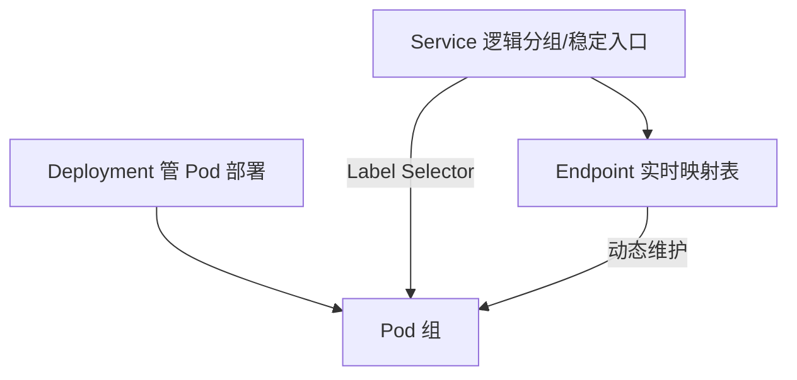
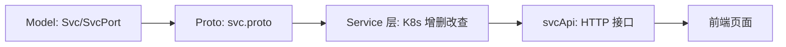

# Go PaaS 平台开发: Service 服务管理章节总结与思考

## 纲要

- 本章知识点回顾：Service 四种类型、Service 与 Deployment/Pod/Endpoint 的关系
- 实战链路：model → proto → service(K8s CRUD) → svcApi(HTTP 接口) → 前端
- 工程经验：一个 Service 可绑定多组 Pod；应用应访问 Service 名而非 Pod 名 / IP
- 两个课后思考题：另三种类型的更多场景；Service 与 ReplicaSet Controller 的关系

## 知识点回顾

### 四种 Service 类型

- `ClusterIP`：最常用，仅集群内通过 DNS 名 / 内网 IP 访问，默认模式。
- `NodePort`：把服务暴露到集群外，受 `30000~32767` 端口数限制，常用于中间件。
- `LoadBalancer`：云厂商提供独立负载均衡 IP，自动叠加 NodePort + ClusterIP，中间件场景常见。
- `ExternalName`：把集群外服务映射为集群内 Service，依赖 DNS，屏蔽外部服务不在 K8s 内管理的问题。

### 三者关系

- `Deployment` 管 Pod 的部署状态。
- `Service` 通过逻辑关系把一组 Pod 抽象为一个稳定访问入口。
- `Service` 与 Pod 之间靠 `Endpoint` 这一中间层关联：`Endpoint` 实时记录 Pod 的实际 IP 与暴露端口，`Service` 读取后映射到自身字段，随 Pod 变更实时更新。

## 实战链路总览

本章把"服务管理"从零打通，链路与前几章（应用管理、Pod 管理）完全一致，开发速度因脚手架工具明显提升：

各层职责：model 建表、proto 定契约、Service 层落地 K8s 资源与数据库、svcApi 暴露 HTTP、前端做展示与表单提交。

## 工程经验

- 一个 Service 可以创建多个并绑定到同一组 Pod，以满足不同访问需求。
- 程序调用地址应写 `Service 名称 + Service 端口`（或 Service 的 IP），不要写具体 Pod 名称 / Pod IP——Pod 被调度后名称与 IP 都会变，写死会导致调用失败。

## 课后思考题

1. `ClusterIP` 之外的三种类型还有哪些应用场景？尤其是 `LoadBalancer` 与 `ExternalName`，除了课程提到的场景，你是否想到其它用法？
2. `Service` 与 `ReplicaSet Controller` 之间是否存在关系？它们之间如何协作？

欢迎在讨论区整理并发出你的思考，与大家一起交流。

## 总结

相关度：100%。是否需要继续：否。代码是否可运行：否。
