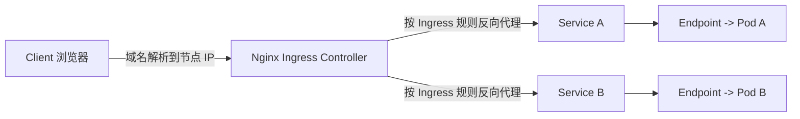
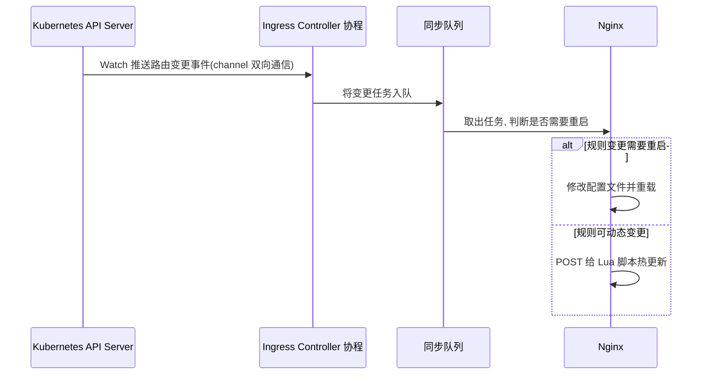

# Go PaaS 平台开发: Ingress 路由架构详解

## 纲要

- 为什么需要 Ingress：ClusterIP / NodePort / LoadBalancer 三种 Service 暴露方式的局限
- Ingress 与 Ingress Controller 两个核心概念
- Ingress 的整体资源对象关系与流量转发架构
- ingress-nginx 的底层运作流程（Watch API Server → 同步队列 → 规则生效）
- Ingress 的本质是 Nginx 反向代理

本章是路由管理功能开发的第一节，重点讲清楚「为什么要有 Ingress」以及「它到底是怎么工作的」。理解了原理，后面用 Go 代码操作 Ingress 才会得心应手。

## 为什么需要 Ingress

在 Kubernetes 中，要把集群内的服务暴露出去，通常会用到 Service 的几种类型，但它们都有明显的短板：

- **ClusterIP**：只能在集群内部通过 Service 名称访问，公网根本访问不通。首先 DNS 解析这一关就过不了，更谈不上从外网打进来。
- **NodePort**：把 Service 通过节点上的随机端口暴露出去，从公网确实能访问。但集群里服务上千个之后，这些随机端口极难管理，端口数量本身也有限，很容易被耗尽。
- **LoadBalancer**：依赖云平台（如阿里云、华为云），必须有一个外部地址把流量映射进来，受云厂商约束。

这三类问题统一的解法，就是在 Service 之上再抽象一层 **Ingress（路由）**。

## 两个核心概念

Ingress 体系里有两个必须区分清楚的对象：

- **Ingress**：一个普通的 Kubernetes 资源对象，用来声明「具体的路由规则」——某个域名、某个路径，要转发给哪个 Service。你可以把它类比成 Nginx 的 `nginx.conf` 配置文件。
- **Ingress Controller**：真正「执行」这些规则的控制器。它监听 Ingress 对象的变化，并驱动底层代理（本课程使用 ingress-nginx）把规则落地。它下面挂着具体的 Pod，通过 Nginx 完成转发。

> 类比：如果 Ingress Controller 是 Nginx 进程本身（以及监听的端口），那么 Ingress 就是 Nginx 里的那份配置文件。我们通过代码操作的就是 Ingress 这个对象。

Ingress Controller 不止 ingress-nginx 一种，课程选用的是最主流的 **ingress-nginx**。

## Ingress 整体架构

请求进入集群后，先到达 Ingress Controller（课程采用 DaemonSet 模式，每个节点通过主机 80/443 端口接收流量，而非官方默认的 Deployment + LoadBalancer 模式）。Controller 依据 Ingress 规则判断转发路径，再转发到集群内部的 Service，Service 通过 Endpoint 管理 Pod 信息，最终访问到具体的 Pod。Deployment 与 ReplicaSet 则负责管控这些 Pod 的生命周期。

## ingress-nginx 的运作流程

把 Ingress Controller 跑在 Kubernetes 里之后，它如何把后端 Pod 的 IP、端口实时同步到 Nginx 配置？核心流程如下：

1. 创建 Ingress Controller 时，会启动一个**协程（goroutine）**与 API Server 建立双向通信（Watch）。
2. 当发现需要更新的事件，事件通过 channel 被读取。
3. Controller 做一系列判断后，把任务塞进**同步队列**（也是一个协程在实时消费）。
4. 在队列里判断该条规则是否需要重启 Nginx：Nginx 修改配置后必须 reload 才生效，这种情况就改配置并重启；否则通过 **POST 请求把数据变更发送给 Lua 脚本**，由 Lua 实现规则的热更新，无需重启。

无论 Ingress、Controller、路由规则怎么变，只要底层用的是 ingress-nginx，最终都会把所有规则转化为 Nginx 的反向代理配置。本质上，ingress-nginx 就是一款「针对 Kubernetes 做了特殊适配的 Nginx 反向代理」。

## 小结

本节建立了 Ingress 的基础认知与整体架构视图。下一节开始，我们用 Go 代码创建并管理路由的 model、repository、service 与 handler，并通过 `kubectl` 在 Kubernetes 中部署 ingress-nginx。

## 📎 文本↔代码关联

本讲在课程知识图谱（见 `_GRAPH.json` / `_GRAPH.mmd`）中关联以下代码文件：

- `code/课件/ingress/README.md`
- `code/课件/docker-compose/chapter3/elasticsearch/config/elasticsearch.yml`
- `code/课件/docker-compose/chapter3/kibana/config/kibana.yml`
- `code/课件/docker-compose/chapter3/logstash/config/logstash.yml`
- `code/课件/docker-compose/chapter3/logstash/pipeline/logstash.conf`
- `code/课件/common/swap.go`
- `code/课件/docker-compose/chapter2/docker-compose.yml`
- `code/课件/appstore/domain/model/app_comment.go`

> 关联由 `scan_course.py` 自动建立，边类型 `uses-code`（讲次 → 代码）。

相关度：100%。是否需要继续：是。代码是否可运行：否。
