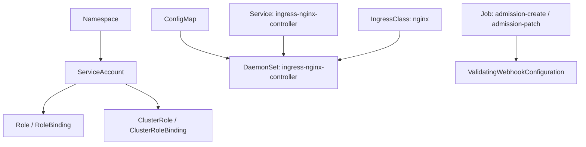

# Go PaaS 平台开发: 在 Kubernetes 中部署 Nginx Ingress Controller

## 纲要

- 为什么要在前端开发前先部署 Ingress Controller
- `deploy.yml`：官方 ingress-nginx 清单，含 RBAC / ConfigMap / Service / DaemonSet / IngressClass
- 课程的关键改造点：用 **DaemonSet** 替代官方 Deployment + LoadBalancer
- `hostNetwork: true` 直接占用节点 80/443 端口
- 部署命令：`kubectl apply -f deploy.yml`

在开发前端页面之前，必须先把 ingress-nginx 跑在 Kubernetes 集群里。否则后端无论怎么创建路由，前端访问都会报错——因为没有 Controller 去承接流量、把规则落地。

## 部署清单概览

`ingress/README.md` 只有一句：在 master 节点执行 `kubectl apply -f deploy.yml`。该清单来自官方 ingress-nginx v1.2.0，包含以下资源对象：



## 与官方模板的关键差异

课程对官方清单做了三处调整，部署时一定要留意：

1. **DaemonSet 替代 Deployment**：官方默认用 `Deployment` + `LoadBalancer`（后者依赖云厂商外部 IP），课程注释掉 `kind: Deployment`，改用 `kind: DaemonSet`，让每个节点都跑一个 Controller Pod，不依赖云厂商 IP。

```yaml
apiVersion: apps/v1
#kind: Deployment
kind: DaemonSet
metadata:
  name: ingress-nginx-controller
  namespace: default
```

2. **hostNetwork 直接占用主机端口**：`dnsPolicy: ClusterFirstWithHostNet` 配合 `hostNetwork: true`，Controller 直接使用节点主机的 80 和 443 端口对外服务，不再走 NodePort 随机端口。

```yaml
dnsPolicy: ClusterFirstWithHostNet
hostNetwork: true
nodeSelector:
  kubernetes.io/os: linux
```

3. **IngressClass 名称是 `nginx`**：清单里 `IngressClass` 的 `name: nginx`，与代码中 `setIngress` 设置的 `IngressClassName: "nginx"` 必须一致，否则 Controller 不认这条规则。

```yaml
apiVersion: networking.k8s.io/v1
kind: IngressClass
metadata:
  name: nginx
spec:
  controller: k8s.io/ingress-nginx
```

Service 一段保留了 80/443 的定义，但把 `type: LoadBalancer` 注释掉，因为 DaemonSet + hostNetwork 模式下流量直接进节点端口：

```yaml
apiVersion: v1
kind: Service
metadata:
  name: ingress-nginx-controller
  namespace: default
spec:
  ports:
  - name: http
    port: 80
    targetPort: http
  - name: https
    port: 443
    targetPort: https
  selector:
    app.kubernetes.io/component: controller
    app.kubernetes.io/name: ingress-nginx
#  type: LoadBalancer
```

## 部署与验证

把 `deploy.yml` 下载到 master 节点后执行：

```bash
kubectl apply -f deploy.yml
```

执行完后检查：

- `kubectl get svc`：会多出 `ingress-nginx-controller` 与 `ingress-nginx-controller-admission` 两个 Service。
- `kubectl get ds`：应能看到 `ingress-nginx-controller` 这个 DaemonSet 已就绪（之前若创建过旧的，可先删再重建）。

若能看到 Controller 的 Pod 处于 Running，说明部署成功。这一步是后续前端创建路由的前提，**务必先部署**，否则前端调用后端创建 Ingress 会因没有 Controller 而报错。

## 技术点总结

- ingress-nginx 部署是路由功能闭环的前置条件。
- 课程用 DaemonSet + hostNetwork 模式，规避云厂商依赖，主机 80/443 直接承接流量。
- IngressClass 名称 `nginx` 必须与代码中的 `IngressClassName` 对齐。
- 部署命令就一行：`kubectl apply -f deploy.yml`。

## 📎 文本↔代码关联

本讲在课程知识图谱（见 `_GRAPH.json` / `_GRAPH.mmd`）中关联以下代码文件：

- `code/课件/docker-compose/chapter3/elasticsearch/config/elasticsearch.yml`
- `code/课件/docker-compose/chapter3/kibana/config/kibana.yml`
- `code/课件/docker-compose/chapter3/logstash/config/logstash.yml`
- `code/课件/docker-compose/chapter3/logstash/pipeline/logstash.conf`
- `code/课件/common/swap.go`
- `code/课件/docker-compose/chapter2/docker-compose.yml`
- `code/课件/appstore/domain/model/app_comment.go`
- `code/课件/docker-compose/chapter3/prometheus.yml`

> 关联由 `scan_course.py` 自动建立，边类型 `uses-code`（讲次 → 代码）。

相关度：100%。是否需要继续：是。代码是否可运行：否。
