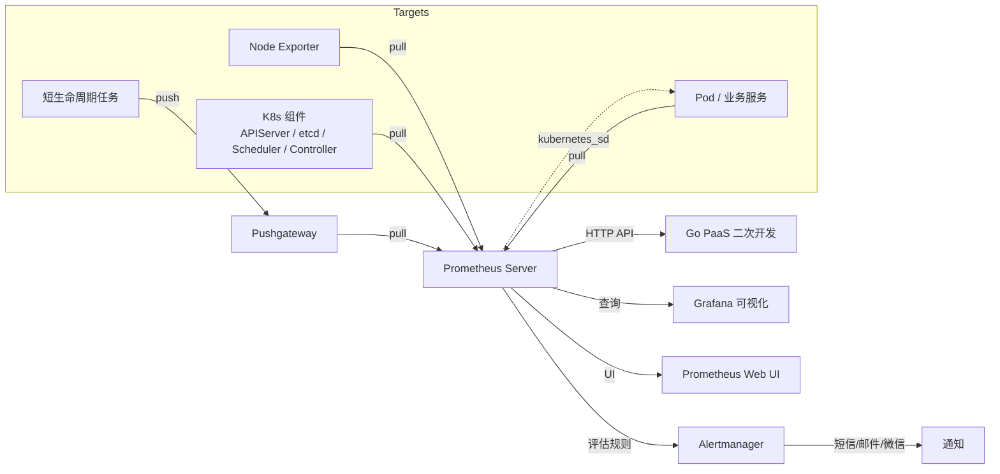

# Go PaaS 平台开发: Prometheus 监控系统架构介绍

## 纲要

- 监控系统的目标：发现已有问题、预防即将出现的问题（如基于指标自动扩缩容）
- 监控内容：基础指标、服务存活、个性化接口监控、日志监控
- K8s 监控对象：节点资源、Pod 服务、K8s 自身组件
- 监控四步：采集 → 存储 → 告警规则 → 报警（通知）
- Prometheus 定位：开源监控 + 告警 + 时序数据库的组合，多维数据模型
- 采集方式：Pull（主动拉取）与 Push（主动上报，经 Pushgateway）
- 核心组件：Prometheus Server、Exporter、Pushgateway、Alertmanager、Grafana
- K8s 指标来源：Node Exporter、kubelet/cAdvisor、etcd/APIServer/Controller Manager/Scheduler 暴露的端口

## 监控系统要解决什么问题

在 Go PaaS 平台中，监控是整个集群稳定运行的“眼睛”。搭建监控系统的目标可以归纳为两类：

- 发现已经存在的问题：例如某节点内存打满、某 Pod 频繁重启。
- 预防即将出现的问题：基于历史与实时指标做决策，例如当命名空间平均 CPU 使用率超过 30% 时自动扩容 Pod；当余额不足时改为短信告警而非直接扩容。

对 PaaS 平台而言，监控数据最终要反哺业务：按命名空间统计资源用量、按子公司/业务组核算费用、决定某个 Pod 是否到期回收。

## 监控的内容

广义的监控系统可以采集以下四类内容：

- 系统基础指标：CPU、内存、磁盘 IO、网络 IO 等。
- 服务信息：进程是否存活、资源占用情况。
- 个性化监控：固定接口的返回值、业务埋点。
- 日志内容：聚合后的日志指标。

在 K8s 场景下，监控主要聚焦三个方面：

- 节点（Node）：磁盘、CPU、内存、网络 IO。
- 服务（Pod）：业务容器的资源与状态。
- K8s 自身组件：etcd、APIServer、Controller Manager、Scheduler。

## 监控的四个步骤

无论采用什么工具，监控链路都是一致的：

1. 采集：配置采集目标与采集内容。
2. 存储：将指标写入时序数据库。
3. 告警规则：基于存储的数据设定阈值，例如 CPU 平均使用超过 80% 触发告警。
4. 报警：通过短信、邮件、微信等方式通知。

## Prometheus 是什么

Prometheus 不是单一程序，而是一套开源的监控、告警与时序数据库的组合。它由 `metrics` 与多维 `label` 标识构成数据模型，支持 Pull 与 Push 两种采集方式：

- Pull：Prometheus 根据配置的目标地址，按周期主动拉取指标。在 K8s 中通过 Service Discovery 自动发现 Pod 并拉取。
- Push：短生命周期任务完成后，主动把指标推送到 Pushgateway，再由 Prometheus 拉取。

## Prometheus 架构与核心组件

Prometheus 各组件之间的关系如下图所示：



核心组件：

- Prometheus Server：负责采集、本地 TSDB 存储、执行 PromQL 查询与评估告警规则。
- Exporter：部署在节点或应用侧，把指标以 HTTP 接口暴露给 Prometheus。例如 Node Exporter 暴露主机指标。
- Pushgateway：接收短作业的 Push 指标，供 Prometheus 拉取。
- Alertmanager：接收 Prometheus 触发的告警，做去重、分组并路由到短信/邮件/微信等通道。
- Grafana：生产环境常用的可视化层，图表能力远强于 Prometheus 自带 UI。
- Prometheus Web UI：内置查询界面，便于调试。

## 数据采集方式：Pull 与 Push

- 微服务与 K8s 组件通常采用 Pull：Prometheus 周期性抓取 `/metrics` 端点。
- 短作业（完成时间不确定）采用 Push：任务结束后把结果写入 Pushgateway。
- K8s 中的 Pod 通过 `kubernetes_sd_configs` 自动注册发现，Prometheus 拉取后作为采集目标。

## K8s 中的指标来源

| 监控对象 | 指标暴露方 | 采集方式 |
| --- | --- | --- |
| 服务器/节点 | Node Exporter | Pull |
| 容器 | kubelet 内置 cAdvisor | Pull |
| etcd | 2379 端口 `/metrics`（HTTPS） | Pull |
| APIServer | 固定端口 `/metrics` | Pull |
| Controller Manager | 固定端口 `/metrics` | Pull |
| Scheduler | 固定端口 `/metrics` | Pull |

## 配置示例

下面是一个 Prometheus 配置示例，既包含单机静态采集，也演示了 K8s 服务发现：

```yaml
global:
  scrape_interval: 15s          # 默认 15 秒采集一次
  evaluation_interval: 15s
  external_labels:
    monitor: 'go-paas-monitor'

scrape_configs:
  # 基础服务静态采集（docker-compose 单机场景）
  - job_name: 'base'
    static_configs:
      - targets: ['192.168.0.108:9192']

  # K8s 服务发现：自动拉取集群内带注解的 Pod 指标
  - job_name: 'kubernetes-pods'
    kubernetes_sd_configs:
      - role: pod
    relabel_configs:
      - source_labels: [__meta_kubernetes_pod_annotation_prometheus_io_scrape]
        action: keep
        regex: "true"
```

## API 速览

Prometheus 提供 HTTP API，便于 Go PaaS 平台做二次开发（如展示特定 Pod 的监控数据）。

- `GET /api/v1/query`：瞬时查询，参数 `query`（PromQL）。
- `GET /api/v1/query_range`：区间查询，参数 `query`、`start`、`end`、`step`。
- `GET /api/v1/targets`：查看当前采集目标与健康状态。

示例：

```bash
# 查询所有采集目标是否在线
curl 'http://prometheus.monitor.svc:9090/api/v1/query?query=up'
```

## Demo 示例

用 Docker 启动单节点 Prometheus 验证上面的配置：

运行说明：

```bash
# 将上面的配置保存为 prometheus.yml，启动容器
docker run -d --name prometheus \
  -p 9090:9090 \
  -v $(pwd)/prometheus.yml:/etc/prometheus/prometheus.yml \
  prom/prometheus:v2.45.0
```

代码说明：`-v` 把宿主机配置挂载进容器；`prom/prometheus:v2.45.0` 为社区稳定版本。

技术点总结：Prometheus 以配置文件驱动采集目标，本地 TSDB 存储时序数据，HTTP API 可被外部系统直接调用。

## 总结

## 📎 文本↔代码关联

本讲在课程知识图谱（见 `_GRAPH.json` / `_GRAPH.mmd`）中关联以下代码文件：

- `code/课件/docker-compose/chapter3/prometheus.yml`
- `code/课件/common/prometheus.go`
- `code/课件/docker-compose/chapter3/elasticsearch/config/elasticsearch.yml`
- `code/课件/docker-compose/chapter3/kibana/config/kibana.yml`
- `code/课件/docker-compose/chapter3/logstash/config/logstash.yml`
- `code/课件/docker-compose/chapter3/logstash/pipeline/logstash.conf`
- `code/课件/common/swap.go`
- `code/课件/docker-compose/chapter2/docker-compose.yml`

> 关联由 `scan_course.py` 自动建立，边类型 `uses-code`（讲次 → 代码）。

相关度：95%。是否需要继续：[否]。代码是否可运行：[是]。
