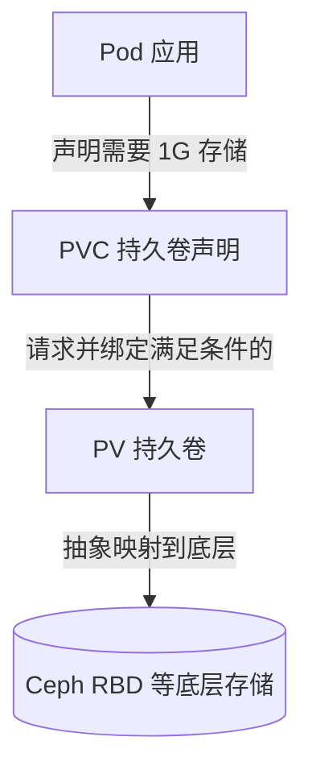
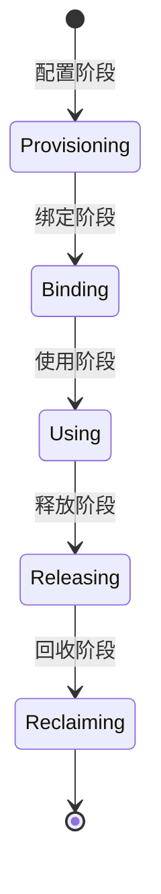

# Go PaaS 平台开发: PV 与 PVC 的关系和原理说明

## 纲要

- PV 与 PVC 的定义及映射关系：PV 是底层存储的抽象，PVC 是用户对存储的请求
- PV 的三种访问模式：RWO / ROX / RWX
- PV 的三种回收策略与四种状态
- PVC 的关键参数：访问模式、选择器、存储类、容量
- PV/PVC 的生命周期：配置（静态/动态）→ 绑定 → 使用 → 释放 → 回收

## 为什么需要 PV/PVC

在 K8s 中，Pod 是最小调度单元，默认是无状态的。一旦容器被重新调度或重启，写进容器内部的数据就会丢失。为了让 MySQL 数据、用户上传附件等能够持久化落盘，需要把分布式存储（如 Ceph RBD）挂载到 Pod 上。

但直接让应用去感知底层存储细节是糟糕的设计。K8s 用两层抽象解耦这件事：

- **PV（PersistentVolume，持久卷）**：对底层共享存储（Ceph、NFS、CephFS 等）的一种抽象，代表集群中一块真实可用的存储资源。PV 通常由系统按需自动生成。
- **PVC（PersistentVolumeClaim，持久卷声明）**：用户对存储的「请求」。当应用需要 1G 空间时，它发起的是 PVC，而非直接操作 PV。

二者关系如下：

PVC 与 PV 是一一对应的：PVC 申请资源，K8s 找一块大小满足（≥请求值）的 PV 进行绑定，PV 再映射到具体的底层存储。在 Go PaaS 平台的存储功能开发中，我们主要开发的是 **PVC 这一侧**——只需关注核心参数，通过接口/服务把 PVC 创建到 K8s，并与平台业务记录关联，再绑定到具体业务上。

## PV 的访问模式

访问模式（accessModes）描述卷能被如何挂载，共三种：

| 模式 | 含义 | 适用场景 |
| --- | --- | --- |
| ReadWriteOnce（RWO） | 可读可写，但只能被**一个** Pod 挂载 | 最常用，如中间件（一个 Pod 挂一块盘） |
| ReadOnlyMany（ROX） | 只读，可被**多个** Pod 同时挂载 | 配置文件分发（类似 ConfigMap） |
| ReadWriteMany（RWX） | 可读可写，可被**多个** Pod 同时挂载 | 多 Pod 共享同一磁盘（如共享附件目录），仅少数存储系统支持 |

## PV 的回收策略

- **Retain（保留）**：不主动清理，需手动回收 volume。
- **Recycle（回收）**：删除数据后重新提供（相当于清空目录下所有数据再复用）。
- **Delete（删除）**：删除 PV 及相关的所有后端存储资源。

## PV 的状态

PV 在其生命周期中处于四种状态之一：

- **Available**：可用且健康，尚未被绑定。
- **Bound**：已与 PVC 绑定，可正常使用。
- **Released**：PVC 已解绑，但回收策略尚未执行（过渡阶段）。
- **Failed**：卷异常，进入错误状态。

## PVC 的关键参数

PVC 由用户侧发起，需声明以下关键参数：

- **accessModes**：访问权限，与 PV 的访问模式对应。
- **selector（选择器）**：通过 label 筛选 PV。注意：即使选择器命中，若 PVC 请求 3G 而 PV 只有 2G，仍会绑定失败。手动创建 PV 并绑定时才常用到选择器；动态绑定场景下一般不用。
- **storageClassName（存储类）**：指向平台预置的 StorageClass，动态创建 PV 时由此决定用哪个 provisioner。
- **存储大小**：请求容量必须明确（如 1Gi），所有存储都按大小绑定。

## PV/PVC 的生命周期

1. **Provisioning（配置）**
   - 静态配置：管理员手动创建多个 PV，属性与真实存储已确定。
   - 动态配置：通过 StorageClass，PVC 提交后 K8s 自动按请求容量创建对应 PV，资源利用更充分（避免手动固定 2G 导致申请 1.5G 时浪费 0.5G）。
2. **Binding（绑定）**：PVC 创建后与满足条件的 PV 绑定，长期稳定处于 `Bound` 状态；若 PVC 无法创建，依赖它的 Pod 也无法创建。
3. **Using（使用）**：Pod 正常读写存储数据。
4. **Releasing（释放）**：Pod 删除或 PV 不再使用，进入释放。
5. **Reclaiming（回收）**：根据回收策略处理被释放的 PV。

动态创建时 PV 与 PVC 基本一一对应，长期可见的是「绑定」与「使用」两个稳定状态，其余阶段通常转瞬即逝。

## 小结

理解 PV/PVC 的抽象关系与生命周期，是开发 Go PaaS 平台存储功能的基础：平台侧只需负责 PVC 的创建与参数管理，PV 与底层 Ceph 存储的映射交给 K8s 与 StorageClass 自动完成。

## 📎 文本↔代码关联

本讲在课程知识图谱（见 `_GRAPH.json` / `_GRAPH.mmd`）中关联以下代码文件：

- `code/课件/docker-compose/chapter3/elasticsearch/config/elasticsearch.yml`
- `code/课件/docker-compose/chapter3/kibana/config/kibana.yml`
- `code/课件/docker-compose/chapter3/logstash/config/logstash.yml`
- `code/课件/docker-compose/chapter3/logstash/pipeline/logstash.conf`
- `code/课件/common/swap.go`
- `code/课件/docker-compose/chapter2/docker-compose.yml`
- `code/课件/appstore/domain/model/app_comment.go`
- `code/课件/docker-compose/chapter3/prometheus.yml`

> 关联由 `scan_course.py` 自动建立，边类型 `uses-code`（讲次 → 代码）。

相关度：93%。是否需要继续：[是]。代码是否可运行：[否]。
