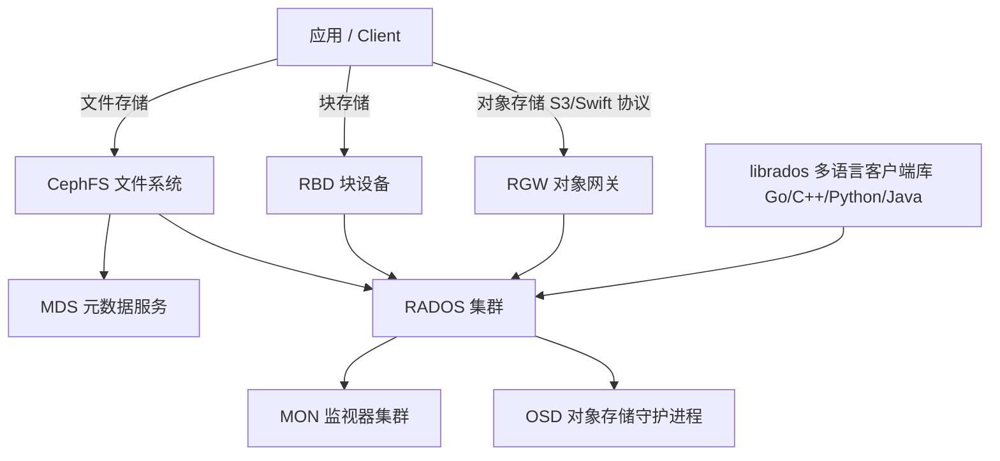

# Go PaaS 平台开发: 分布式存储 Ceph 架构介绍

## 纲要

- Ceph 在 Go PaaS 平台中的定位：为运行在 K8s 中的有状态负载（MySQL 数据、上传附件等）提供数据落盘能力
- Ceph 的三大特性：高性能、高可用、高扩展（去中心化架构）
- 三种存储类型：块存储（RBD）、文件存储（CephFS）、对象存储（RGW）
- 核心架构：以 RADOS 为底座，包含 OSD、MON、MDS 等组件，向上通过 librados / RBD / RGW / CephFS 暴露接口

## Ceph 在 PaaS 平台中的角色

在 Go PaaS 平台里，K8s 中运行的容器本质上是无状态的。一旦业务需要保存有状态数据——例如 MySQL 的表数据、用户上传的附件——就必须依赖外部存储来完成数据落盘。Ceph 作为分布式存储底座，承担的就是这部分职责：它让平台中的各类应用能够按需申请、挂载持久化存储卷。

本章后续会讲解 Ceph 的安装、通过 K8s CSI 将其接入集群，以及用 Go 后端代码自动化地创建/销毁存储卷。本节先建立对 Ceph 的整体认知。

## Ceph 的特性

Ceph 之所以适合作为 PaaS 平台的统一存储底座，源于它的三项核心特性：

- **高性能**：支持上千个节点规模，单集群可承载 TB 到 PB 级数据，满足中大型业务对容量与吞吐的要求。
- **高可用**：通过故障域（Failure Domain）将正常域与故障域隔离。当某个故障域异常时，副本可以临时顶上，保证数据强一致且可自动修复。
- **高扩展**：整体采用去中心化架构，扩展节点非常灵活。需要注意的是，扩展性与 PG（Placement Group）数量规划密切相关，PG 规划不当会拖累集群性能。

## Ceph 的存储类型

Ceph 对外提供三种存储形态，可以类比理解：

- **块存储（RBD，RADOS Block Device）**：对应传统硬盘、磁盘阵列，直接把一块裸盘挂载给物理机或虚拟机使用。K8s 中挂载的云盘走的就是 RBD。
- **文件存储（CephFS）**：对应 FTP 服务器这类文件系统，把多个小块组合成目录树形式的文件对象，对外提供 POSIX 兼容的文件系统。
- **对象存储（RGW，RADOS Gateway）**：对应海量硬盘 + 文件索引的对象模型，对外兼容 S3 / Swift 协议。

一个形象的类比：块存储像一颗颗 raw 的玉米粒；文件存储像一整根玉米棒（由小块组合成文件对象）；对象存储像已经加工封装好的独立单元。

## Ceph 整体架构

Ceph 的架构可以抽象为「上层接口 — librados 抽象层 — RADOS 集群」三层。

### RADOS：集群的基石

RADOS（Reliable Autonomic Distributed Object Store，高可靠、自管理的分布式对象存储）是 Ceph 存储集群的基础。任何 Ceph 集群都构建在 RADOS 之上，所有数据都以对象（Object）的形式存储。

### librados：对外抽象层

librados 建立在 RADOS 之上，对底层做了一层抽象与封装，使上层应用可以通过多语言 API 直接访问 RADOS。它支持 Go、C/C++、Python、Java 等，是应用层开发（对象存储、块存储、文件存储）的统一入口。

### 上层接口

- **RADOS Gateway（RGW）**：基于 Swift / S3 协议实现，兼容标准的对象存储协议，用于对外提供 OSS / 对象存储能力。
- **RBD**：提供分布式块设备接口，把镜像像磁盘一样挂载使用。K8s 中使用的 Ceph 存储正是通过 RBD 实现的。
- **CephFS**：一个兼容 POSIX 的分布式文件系统，可基于它自研 OSS 或文件管理系统。

### 核心组件

- **OSD（Object Storage Daemon）**：Ceph 最基础的存储进程，每个 OSD 管理一块物理硬盘及之上的操作系统层，真正负责数据的读写与复制。
- **MON（Monitor）**：监视器集群，负责监控整个 RADOS 集群的状态与元数据，是集群的「大脑」。
- **MDS（Metadata Server）**：只在 CephFS 文件存储场景中使用，负责维护文件系统的元数据。

## 小结

Ceph 通过 RADOS 统一底座，向上屏蔽了块、文件、对象三种存储的差异；而 OSD / MON / MDS 等组件各司其职，构成了一个去中心化、可水平扩展的分布式存储系统。理解这套架构，是后续安装 Ceph、通过 CSI 接入 K8s 以及用 Go 开发存储管理功能的前提。

## 📎 文本↔代码关联

本讲在课程知识图谱（见 `_GRAPH.json` / `_GRAPH.mmd`）中关联以下代码文件：

- `code/课件/docker-compose/chapter3/elasticsearch/config/elasticsearch.yml`
- `code/课件/docker-compose/chapter3/kibana/config/kibana.yml`
- `code/课件/docker-compose/chapter3/logstash/config/logstash.yml`
- `code/课件/docker-compose/chapter3/logstash/pipeline/logstash.conf`
- `code/课件/common/swap.go`
- `code/课件/docker-compose/chapter2/docker-compose.yml`
- `code/课件/appstore/domain/model/app_comment.go`
- `code/课件/docker-compose/chapter3/prometheus.yml`

> 关联由 `scan_course.py` 自动建立，边类型 `uses-code`（讲次 → 代码）。

相关度：95%。是否需要继续：[是]。代码是否可运行：[否]。
