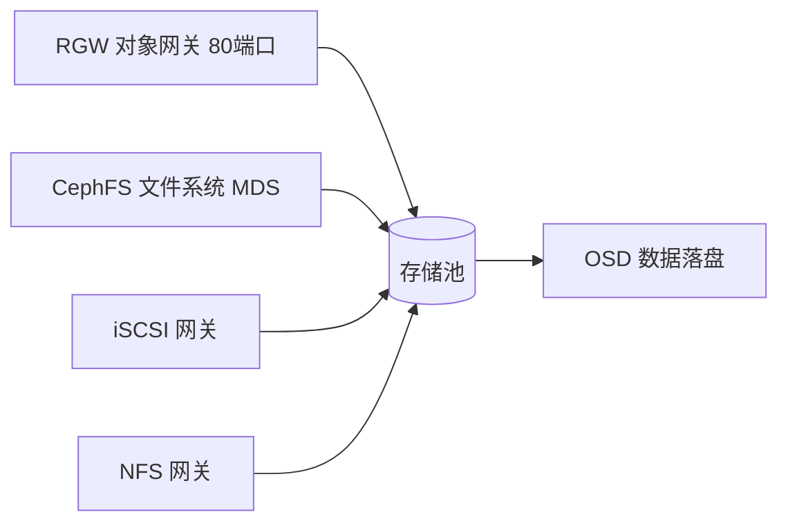

# Go PaaS 平台开发: Ceph 核心组件安装

## 纲要

- 安装 RGW（对象存储网关），并集成进 Dashboard
- 安装 CephFS（文件存储），含自动与手动两种创建池的方式
- 安装 iSCSI 网关（块存储扩展），编辑网关 YAML 注入受信任 IP
- 可选安装 NFS；安装完成后通过 Dashboard 核验集群整体状态

## 组件概览

在基础集群（MON / MGR / OSD）就绪后，需要按需安装对外提供能力的核心组件。它们各司其职：



## 安装 RGW（对象存储网关）

RGW 提供兼容 S3 / Swift 的对象存储接口，安装只需一条命令：

```bash
# 部署 3 副本的 rgw 实例到三个节点
ceph orch apply rgw rgw.default --placement='3 ceph01 ceph02 ceph03'
```

安装过程中可通过 `ceph -s` 查看进程，RGW 默认监听 **80 端口**。启动成功后状态显示为 `3/3`。

将 RGW 集成进 Dashboard 以便统一查看：

```bash
# 生成 RGW 访问/密钥并写入 Dashboard（示意）
ceph dashboard set-rgw-api-access-key '<access-key>'
ceph dashboard set-rgw-api-secret-key '<secret-key>'
ceph dashboard set-rgw-api-host 'ceph01'
ceph dashboard set-rgw-api-port 80
ceph dashboard set-rgw-api-scheme http
```

集成完成后，Dashboard 的 Object Gateway（对象网关）区域会出现 RGW 相关信息；同时 RGW 会自动创建出相应的存储池（例如 `.rgw.root` 等 4 个池）。

## 安装 CephFS（文件存储）

CephFS 由 MDS 提供元数据服务，对外暴露 POSIX 兼容的文件系统。

### 方式一：自动创建（推荐）

```bash
ceph fs volume create cephfs
```

该命令会自动创建 data 与 metadata 两个存储池并拉起 MDS。

### 方式二：手动创建池

```bash
# 先创建数据与元数据池（PG 数按集群规模调整）
ceph osd pool create cephfs_data 128
ceph osd pool create cephfs_metadata 128
# 再创建文件系统
ceph fs new cephfs cephfs_metadata cephfs_data
```

安装后用以下命令观察：

```bash
ceph fs ls
ceph mds stat
```

`ceph fs ls` 会显示 `cephfs` 文件系统；MDS 状态在创建后约一分钟内从 `creating` 变为 `active`（3 个 up）。回到 Dashboard 的 Filesystems 区域即可看到 CephFS 已自动出现。

> NFS 也可基于 CephFS 提供，命令形如 `ceph nfs cluster create nfs1 ceph01 ceph02 ceph03`，本课程不实际操作 NFS，按需启用即可。

## 安装 iSCSI 网关（块存储扩展）

iSCSI 网关让 Ceph 以 SCSI 块设备形式对外提供服务，适合需要挂载裸块设备的场景。

### 创建专用存储池

```bash
# PG 与 PGP 数量保持一致，过大或过小都会报错
ceph osd pool create iscsi 64 64
```

### 编辑网关 YAML 并部署

iSCSI 网关需要一份描述文件，注入受信任的节点 IP（例如 ceph01/02/03 的内网 IP 172.31.96.73/74/75），并声明服务类型：

```yaml
apiVersion: ceph.rook.io/v1
kind: CephISCSIGateway
metadata:
  name: iscsi-gateway
  namespace: rook-ceph
spec:
  instances: 1
  # 受信任的节点 IP，用于 gateway 间通信与客户端访问
  trustedIPs:
    - 172.31.96.73
    - 172.31.96.74
    - 172.31.96.75
  pool: iscsi
  # 服务类型固定为 rbd
  serviceType: rbd
```

应用后启动 iSCSI 网关：

```bash
kubectl apply -f iscsi-gateway.yaml   # 若走 Rook；纯 cephadm 可用 gwcli / ceph-iscsi 配置
```

稍等约一分钟内即可启动成功，Dashboard 的 iSCSI 区域会出现 3 个状态，之前为空的位置现已填充数据。

## 核验集群整体状态

全部组件安装完成后，回到 Dashboard 可见：

- PGS 数量提升（例如达到 185）；
- OSD 数量（例如 8 个）与对象数（例如 216）均在增长；
- RGW / CephFS / iSCSI 各自的状态面板均有数据。

至此 Ceph 整个系统安装完毕。下一节将把该 Ceph 集群通过 K8s CSI 接入 PaaS 平台运行的 K8s 中。

## 📎 文本↔代码关联

本讲在课程知识图谱（见 `_GRAPH.json` / `_GRAPH.mmd`）中关联以下代码文件：

- `code/课件/docker-compose/chapter3/elasticsearch/config/elasticsearch.yml`
- `code/课件/docker-compose/chapter3/kibana/config/kibana.yml`
- `code/课件/docker-compose/chapter3/logstash/config/logstash.yml`
- `code/课件/docker-compose/chapter3/logstash/pipeline/logstash.conf`
- `code/课件/common/swap.go`
- `code/课件/docker-compose/chapter2/docker-compose.yml`
- `code/课件/appstore/domain/model/app_comment.go`
- `code/课件/docker-compose/chapter3/prometheus.yml`

> 关联由 `scan_course.py` 自动建立，边类型 `uses-code`（讲次 → 代码）。

相关度：90%。是否需要继续：[是]。代码是否可运行：[是]。
