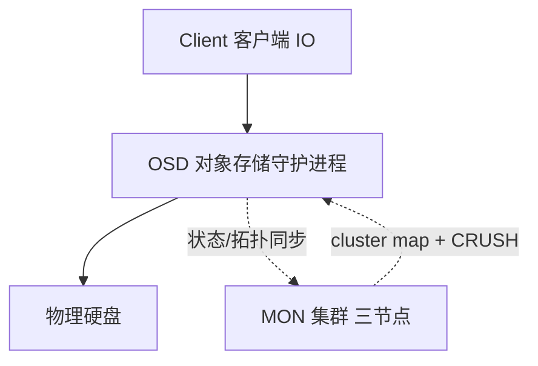
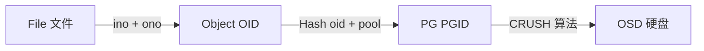

# Go PaaS 平台开发: Ceph 存储过程与核心概念

## 纲要

- 客户端 IO 直接访问 OSD，不经过统一网关，规避瓶颈、支持线性水平扩展
- 存储过程：File → 切分 Object（OID） → 哈希得到 PGID → CRUSH 算法落到 OSD
- 逻辑概念：File、Object（对象，受 RADOS 大小限制）、PG（放置组）、OSD、OID、PGID
- 引入 PG 的两大目的：提供类似数据库索引的快速寻址、支撑数据迁移与高可用
- 三层映射关系：File→Object、Object→PG、PG→OSD，其中 PG→OSD 由 CRUSH 实现

## 存储逻辑概览

Ceph 基于对象存储，其底层 IO 路径有这样的特点：

- 客户端通过 IO 直接与 OSD 交互，OSD 直接操作硬盘
- 不经过统一网关转发，因此不会因为网关成为瓶颈，所有 OSD 可线性扩展集群的 IO 能力

同时，集群内所有 OSD 的信息都会通过 MON 集群（通常由 3 个 MON 组成）实时同步，借助 cluster map 保证数据一致性，并通过 CRUSH 算法实现自动化的数据放置。

## 存储过程

当用户存入一个文件（对象）时，Ceph 的存储流程如下：

1. 文件被系统切分为一个个对象（Object），每个对象通过 `ino`（文件 ID）与 `ono`（对象分片编号）经算法生成唯一的 `OID`（Object ID）
2. 通过哈希函数对 OID 与 pool 进行计算，生成 `PGID`（Placement Group ID）
3. 通过 CRUSH 算法，由 PGID 计算出该 PG 应落到的 OSD
4. OSD 与物理硬盘一一对应，数据最终写入硬盘

## 核心逻辑概念

### File 文件

用户用来存储和访问的文件，例如新建的文本、保存的文档。

### Object 对象

Ceph 基本的存储单元。对象的最大尺寸由 RADOS 限定，通常只有 2MB 或 4MB 左右，目的是方便底层存储的组织与管理。当上层传入一个很大的文件时，系统会将其按固定大小切分为大量小对象分别存储。

### PG 放置组

PG（Placement Group，放置组）相当于把一个个对象归纳到某个组中，是一种逻辑概念：

- 在命令系统中可以直接看到对象，但看不到 PG；PG 是极为重要的逻辑抽象
- 在数据寻址中类似数据库中的"索引"，能快速定位数据落在哪块盘
- 一个 PG 可容纳成百上千个 Object
- PG 与 OSD 是多对多关系：一个 OSD 上承载大量 PG，而 PG 在设定后基本不变，OSD 却会因扩缩容而变动

### OSD 对象存储守护进程

OSD（Object Storage Daemon）把 PG 中的对象直接存到其管理的物理硬盘上。

### OID 与 PGID

- `OID`：每个对象的唯一标识，由 `ino`（全局文件 ID）与 `ono`（分片编号，如 a0、a1）通过算法生成
- `PGID`：通过哈希函数对 OID 与 pool 进行计算生成，使数据分布更均匀

## 为什么需要 PG

引入 PG 主要有两个原因：

1. **索引加速**：对象数量极少时若直接寻址到 OSD，速度极慢；有了 PG 这层类似索引的抽象，寻址非常快
2. **数据迁移与高可用**：若没有 PG 概念，单个 OSD 损坏后的数据迁移将极其困难；PG 作为逻辑分组，使数据再均衡与故障迁移可有序进行

因此 PG 数量与 OSD 数量的规划在 Ceph 中非常关键，而 PG→OSD 的映射由 CRUSH 算法完成。

## 三层映射关系

- File → Object（文件切分为对象）
- Object → PG（对象归入放置组）
- PG → OSD（放置组经 CRUSH 落到具体硬盘）

PG 是中间最关键的逻辑概念。面试中常被问到"Ceph 如何存储数据""核心概念是什么"，以上流程即为标准答案。

## 总结

## 📎 文本↔代码关联

本讲在课程知识图谱（见 `_GRAPH.json` / `_GRAPH.mmd`）中关联以下代码文件：

- `code/课件/docker-compose/chapter3/elasticsearch/config/elasticsearch.yml`
- `code/课件/docker-compose/chapter3/kibana/config/kibana.yml`
- `code/课件/docker-compose/chapter3/logstash/config/logstash.yml`
- `code/课件/docker-compose/chapter3/logstash/pipeline/logstash.conf`
- `code/课件/common/swap.go`
- `code/课件/docker-compose/chapter2/docker-compose.yml`
- `code/课件/appstore/domain/model/app_comment.go`
- `code/课件/docker-compose/chapter3/prometheus.yml`

> 关联由 `scan_course.py` 自动建立，边类型 `uses-code`（讲次 → 代码）。

相关度：100%。是否需要继续：是。代码是否可运行：否。
